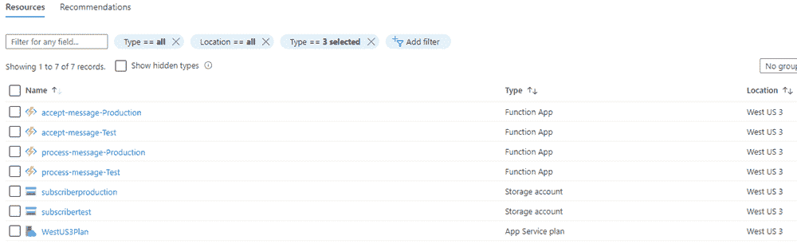
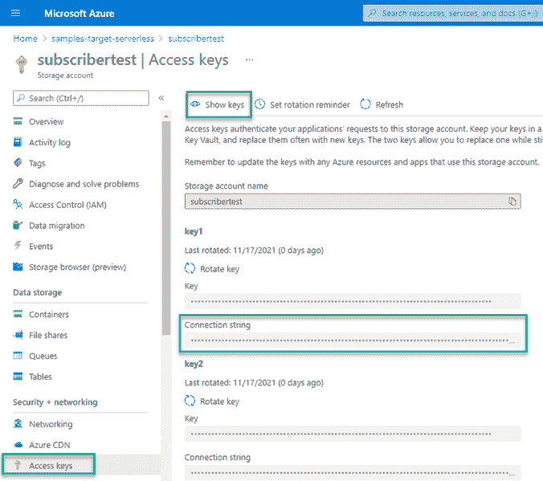
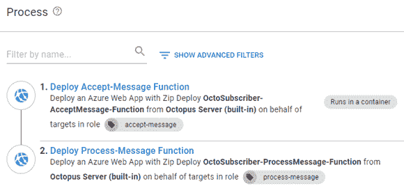
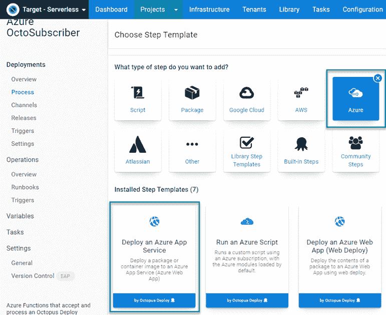
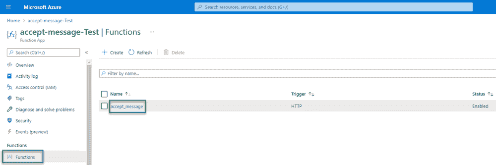
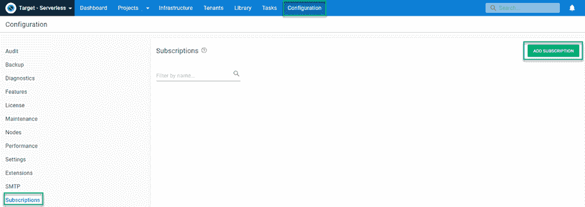
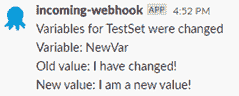

# 可变更新通知-八达通部署

> 原文：<https://octopus.com/blog/variable-update-notification>

沟通对一个成功的团队很重要。每天的单口相声、信息节目和电子邮件让每个人都了解事情的最新进展。不过，信息可能会在混乱中丢失，就像变量值被更新时一样。

Octopus Deploy 的[订阅](https://octopus.com/docs/administration/managing-infrastructure/subscriptions)特性可以配置为在变量被电子邮件或 webhook 自动更新时通知用户。

在这篇文章中，您将学习如何使用订阅功能通过 Azure 函数向 Slack 发布消息。

## 创建 Azure 资源

在创建功能之前，首先需要创建一些 Azure 资源来准备部署。

这篇文章中提出的解决方案使用了以下 Azure 资源:

*   资源组
*   存储帐户
*   存储帐户消息队列
*   两个 Azure 函数:
    *   接受消息
    *   流程消息

这个解决方案的源代码可以在 GitHub 上的 [OctoSubscriber](https://github.com/OctopusSamples/OctoSubscriber) repo 的 **azure** 文件夹中找到。

### 资源组

首先创建一个资源组来存放您将创建的所有其他资源。这使得您的工作易于清理，因为删除资源组将删除其中的所有资源。

您可以通过 Azure 门户或通过将 Azure CLI 脚本添加到运行手册来创建资源组，如下所示:

```
$resourceGroupName = "MyResourceGroup"
$resourceGroupLocation = "westus3"

if ((az group exists --name $resourceGroupName) -eq $false)
{
    Write-Output "Creating resource group $resourceGroupName in $resourceGroupLocation"
    az group create --location $resourceGroupLocation --name $resourceGroupName 
} 
```

### 存储帐户

要使用 Azure 的队列功能，首先创建一个存储帐户。

以下是创建存储帐户的 Azure CLI 命令:

```
# Get variables
$storageAccountName = "MyStorageAccount"
$resourceGroupName = "MyResourceGroup"

# Create Azure storage account
Write-Host "Creating storage account ..."
az storage account create --name $storageAccountName --resource-group $resourceGroupName 
```

### 存储帐户消息队列

邮件队列存在于存储帐户中。创建帐户后，使用以下命令创建队列:

```
# Get variables
$storageAccountName = "MyStorageAccount"
$queueName = "MyMessageQueue"
$resourceGroupName = "MyResourceGroup"

# Get account keys
$accountKeys = (az storage account keys list --account-name $storageAccountName --resource-group $resourceGroupName) | ConvertFrom-JSON

# Create Azure storage queue
Write-Host "Creating queue ..."
az storage queue create --name $queueName --account-name $storageAccountName --account-key $accountKeys[0].Value 
```

### Azure 功能应用

这篇文章中的解决方案使用了两种不同的 Azure 函数:

*   接受消息
*   流程消息

这两个功能都需要在 Octopus Deploy 中注册为目标。

使用 Azure 功能最常见的计划是消费计划(sku Y1)，然而，我无法使用[az function app Plan create](https://docs.microsoft.com/en-us/cli/azure/functionapp/plan?view=azure-cli-latest#az_functionapp_plan_create)CLI 命令，因为`Y1`不是受支持的 sku。

#### 接受消息

Azure CLI 也可以用来创建函数。接受消息函数是用 Node 编写的。JS，所以一定要为运行时指定`node`。

```
# Get variables
$resourceGroupName = "MyResourceGroup"
$appServiceName = "Accept-Message"
$appServiceRuntime = "node"
$storageAccountName = "MyStorageAccount"
$osType = "Windows"
$functionsVersion = 3
$azureLocation = "westus3"

# Create App Service
Write-Host "Creating Accept function app service ..."
az functionapp create --name $appServiceName --consumption-plan-location $azureLocation --resource-group $resourceGroupName --runtime $appServiceRuntime --storage-account $storageAccountName --os-type $osType --functions-version $functionsVersion 
```

#### 流程消息

Provisioning Process-Message 类似于 Accept-Message，只是它是用 C#编写的，并且您需要将`dotnet`指定为运行时版本。

```
# Get variables
$resourceGroupName = "MyResourceGroup"
$appServiceName = "Process-Message"
$appServiceRuntime = "dotnet"
$storageAccountName = "MyStorageAccount"
$osType = "Windows"
$functionsVersion = 3
$azureLocation = "westus3"

# Create App Service
Write-Host "Creating Process function app service ..."
az functionapp create --name $appServiceName --consumption-plan-location $azureLocation --resource-group $resourceGroupName --runtime "$appServiceRuntime" --storage-account $storageAccountName --os-type $osType --functions-version $functionsVersion 
```

对于这两个功能，我都收到了一条消息，提示我没有配置应用洞察。CLI 为您提供了配置它的参数，但是似乎没有办法告诉它您不需要洞察。

配置完所有资源后，资源组的内容应该如下所示:

[](#) 

为测试和生产环境提供资源

## Azure 函数

Accept-Message 函数接收提交的正文，并将其放在消息队列中。将消息放入队列后，将触发 Process-Message，解析消息并发布到 Slack。

### 接受消息

接受消息函数是用 Node 编写的。JS 并且相当基础。如果你从未使用 Node 创建过 Azure 函数。JS，入门[这个教程来自微软](https://docs.microsoft.com/en-us/azure/azure-functions/create-first-function-vs-code-node)。

将以下内容添加到`index.js`:

```
const { QueueClient, QueueServiceClient } = require("@azure/storage-queue");
const connectionString = process.env.AZURE_STORAGE_CONNECTION_STRING;
const queueName = process.env.QUEUE_NAME;
const queueServiceClient = QueueServiceClient.fromConnectionString(connectionString);
const queueClient = queueServiceClient.getQueueClient(queueName);

module.exports = async function (context, req) {
    if (req.body) {
        // Base64 encode message
        let message = req.rawBody;
        let messageBuffer = new Buffer.from(message, 'utf-8');
        let encodedMessage = messageBuffer.toString('base64');

        //await queueClient.sendMessage(req.body.body);
        await queueClient.sendMessage(encodedMessage);
        context.res = {
            body: "Message added!",
            status: 200
        }
    } else {
        context.res = {
            status: 400,
            body: "Request contains no body!"
        };
    }
}; 
```

环境变量`AZURE_STORAGE_CONNECTION_STRING`和`QUEUE_NAME`是在你将函数部署到 Azure 时提供的。

本教程将下载创建 Azure 函数所需的所有`node_modules`，但是，它不会将它们添加到`package.json`文件中。您需要添加引用来使您的函数工作。

### 流程消息

Process-Message 函数由放入队列的消息触发。消息从 JSON 反序列化，解析，然后发送到 Slack。Process-Message 用 C#编写，并使用以下 NuGet 包引用:

*   微软。Azure.WebJobs .扩展.存储
*   微软。函数
*   纽顿软件。Json
*   懈怠。Webhooks

与接受消息类似，处理消息并不复杂:

```
using System;
using Microsoft.Azure.WebJobs;
using Microsoft.Azure.WebJobs.Host;
using Microsoft.Extensions.Logging;
using Newtonsoft.Json;
using Slack;

namespace process_message
{
    public static class process_message
    {
        [FunctionName("process_message")]
        [StorageAccount("AzureWebJobsStorage")]
        public static void Run([QueueTrigger("octopusdeploy", Connection = "")]string myQueueItem, ILogger log)
        {
            // Deserialize message into JSON object
            dynamic subscriptionEvent = JsonConvert.DeserializeObject(myQueueItem);
            string slackUrl = Environment.GetEnvironmentVariable("SlackUrl");
            string slackChannel = Environment.GetEnvironmentVariable("SlackChannel");

            // Create slack objects
            Slack.Webhooks.SlackClient slackClient = new Slack.Webhooks.SlackClient(slackUrl);
            Slack.Webhooks.SlackMessage slackMessage = new Slack.Webhooks.SlackMessage();

            // Get Octopus Event information
            string librarySetName = subscriptionEvent.Payload.Event.ChangeDetails.DocumentContext.Name;
            System.Text.StringBuilder messageText = new System.Text.StringBuilder();

            // Get message from event
            messageText.AppendLine(subscriptionEvent.Payload.Event.Message.ToString());

            if (subscriptionEvent.Payload.Event.ChangeDetails.Differences.Count > 0)
            {
                // Loop through variables collection
                foreach (var difference in subscriptionEvent.Payload.Event.ChangeDetails.Differences)
                {
                    // Split the path
                    string[] parsedDifference = difference.path.ToString().Split("/", StringSplitOptions.RemoveEmptyEntries);

                    if (parsedDifference[0] == "Variables")
                    {
                        // Get the variable index value
                        int variableIndex = int.Parse(parsedDifference[1]);

                        // Add to message
                        messageText.AppendLine(string.Format("Variable: {0}", subscriptionEvent.Payload.Event.ChangeDetails.DocumentContext.Variables[variableIndex].Name));
                        messageText.AppendLine(string.Format("Old value: {0} \r\n New value: {1}", subscriptionEvent.Payload.Event.ChangeDetails.DocumentContext.Variables[variableIndex].Value, difference.value));
                    }
                }
            }

            log.LogInformation($"Posting to Slack: {messageText.ToString()}");

            // Post message to channel
            slackMessage.Channel = slackChannel;
            slackMessage.Text = messageText.ToString();
            slackClient.Post(slackMessage);
        }
    }
} 
```

环境变量`SlackUrl`和`SlackChannel`是在部署过程中提供的。

## 构建和打包功能

Process-Message 是两个函数中唯一需要编译的函数，但是，它们都需要打包。

GitHub repo 包含一个 GitHub 操作构建定义作为示例:

```
# This is a basic workflow to help you get started with Actions

name: Azure Function

on:
  push:
    paths:
      - 'azure/**'

  # Allows you to run this workflow manually from the Actions tab
  workflow_dispatch:

jobs:
  build:
    runs-on: ubuntu-latest
    strategy:
      matrix:
        dotnet-version: ['3.1.x']

    steps:
      - uses: actions/checkout@v2
      - name: Setup .NET Core SDK ${{ matrix.dotnet-version }}
        uses: actions/setup-dotnet@v1.7.2
        with:
          dotnet-version: ${{ matrix.dotnet-version }}

      - name: Create artifacts folder
        run: |
          mkdir "$GITHUB_WORKSPACE/artifacts"
          mkdir "$GITHUB_WORKSPACE/artifacts/process-message"
          mkdir "$GITHUB_WORKSPACE/azure/accept_message/node_modules"

      - name: Restore dependencies for process-message
        working-directory: azure/process_message/process_message
        run: dotnet restore

      - name: Build process-message
        working-directory: azure/process_message/process_message
        run: dotnet build --configuration Release --no-restore --output "$GITHUB_WORKSPACE/artifacts/process-message"

      - name: Install Octopus CLI
        uses: OctopusDeploy/install-octopus-cli-action@v1.1.1
        with:
          version: latest

      - name: Pack and Push
        working-directory: azure/accept_message
        env:
          OCTOPUS_URL: ${{ secrets.OCTOPUS_SERVER }}
          OCTOPUS_API_KEY: ${{ secrets.OCTOPUS_API_KEY }}  
        run: |
          npm ci --production
          octo pack --id=OctoSubscriber-AcceptMessage-Function --format=Zip --version=2021.1.1.$GITHUB_RUN_NUMBER --basePath="$GITHUB_WORKSPACE/azure/accept_message"
          octo pack --id=OctoSubscriber-ProcessMessage-Function --format=Zip --version=2021.1.1.$GITHUB_RUN_NUMBER --basePath="$GITHUB_WORKSPACE/artifacts/process-message"
          octo push --package=OctoSubscriber-AcceptMessage-Function.2021.1.1.$GITHUB_RUN_NUMBER.zip --server=$OCTOPUS_URL --apiKey=$OCTOPUS_API_KEY --space="Target - Serverless"
          octo push --package=OctoSubscriber-ProcessMessage-Function.2021.1.1.$GITHUB_RUN_NUMBER.zip --server=$OCTOPUS_URL --apiKey=$OCTOPUS_API_KEY --space="Target - Serverless" 
```

## 部署功能

这篇文章假设你知道如何在 Octopus Deploy 中创建一个项目，并且不会涉及这个主题。如果您不熟悉，请查看我们的[入门](https://octopus.com/docs/getting-started)指南。

### 变量

在定义我们的部署流程之前，这两个功能都需要定义一些变量:

*   项目。Azure.Storage.ConnectionString
*   项目。Azure .存储.队列.名称
*   项目。Slack.Url
*   项目。松弛。频道。名称

#### 项目。Azure.Storage.ConnectionString

这些函数需要 Azure 存储帐户的连接字符串才能访问队列。这个值可以通过导航到 **Azure 存储帐户**，然后是**访问密钥**来找到。默认情况下，Azure 会创建两个密钥，任何一个都可以。点击**显示键**复制**连接字符串**属性的值。

[](#)

#### 项目。Azure .存储.队列.名称

您之前创建的消息队列的名称。

#### 项目。Slack.Url

这是 Slack 的集成 webhook URL。建议您将此变量设为敏感值。

#### 项目。松弛。频道。名称

这是您希望函数发布到的松弛通道的名称。

### 部署流程

部署流程的步骤如下:

*   部署接受消息功能
*   部署流程消息功能

[](#)

#### 部署接受消息功能

添加一个**部署 Azure 应用服务**步骤。

[](#)

填写该步骤的表单字段:

*   **代表:**您的 Azure Web 应用目标被分配的角色
*   **包**:包含接受消息功能的包
*   **应用程序设置**:使用以下:

```
[
   {
      "name": "AZURE_STORAGE_CONNECTION_STRING",
      "value": "#{Project.Azure.Queue.ConnectionString}",
      "slotSetting": false
   },
   {
      "name": "QUEUE_NAME",
      "value": "#{Project.Azure.Storage.Queue.Name}",
      "slotSetting": false
   }
] 
```

#### 部署流程消息功能

这使用与**部署接受消息功能**相同的步骤模板。填写该步骤的表单字段:

*   **代表**:你的 Azure Web App 目标被分配的角色
*   **包**:包含接受消息功能的包
*   **应用程序设置**:使用以下:

```
[
   {
      "name": "SlackUrl",
      "value": "#{Project.Slack.Url}",
      "slotSetting": false
   },
   {
      "name": "SlackChannel",
      "value": "#{Project.Slack.Channel}",
      "slotSetting": false
   },
   {
      "name": "AzureWebJobsStorage",
      "value": "#{Project.Azure.Queue.ConnectionString}",
      "slotSetting": false
   }
] 
```

## 部署

部署函数看起来像这样:

[](#)

要调用这个函数，需要从 Azure 获取函数 URL。

打开 Azure 门户，导航到您的**功能**。点击**功能**然后链接到您的功能。

[](#)

点击**获取功能 Url** ，然后点击复制图标。这个留着以后用。

[](#)

## 测试通知

部署完函数后，您可以在 Octopus Deploy 中配置一个订阅，以便在变量发生变化时通知您。

要配置订阅，点击**配置**，然后**订阅**，然后**添加订阅**。

[](#)

填写以下字段

*   **名称**:给订阅命名
*   **事件过滤器**:从**文档类型**下拉列表中选择**变量集**
*   **PayloadURL** :从 Azure 粘贴函数 URL

点击**保存**。

现在，当变量发生变化时，您就可以接收时差通知了。要对此进行测试，请更新一个变量。几秒钟后，Octopus 将处理订阅，调用 Azure 函数将 Octopus 有效负载放入队列。Process-Message 函数将触发并发布到 Slack。

[](#)

## 结论

这篇文章演示了如何使用 Octopus Deploy 订阅来调用 Azure 函数，以便在变量发生变化时向 Slack 发布消息。

愉快的部署！