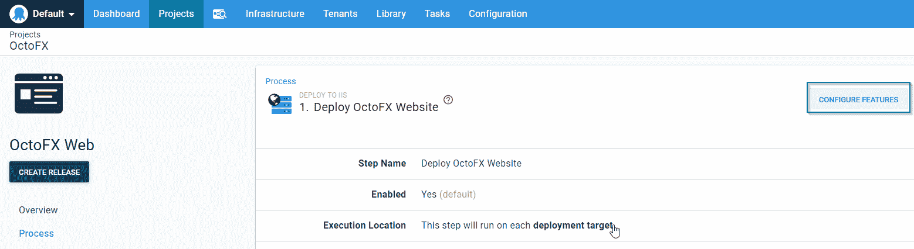
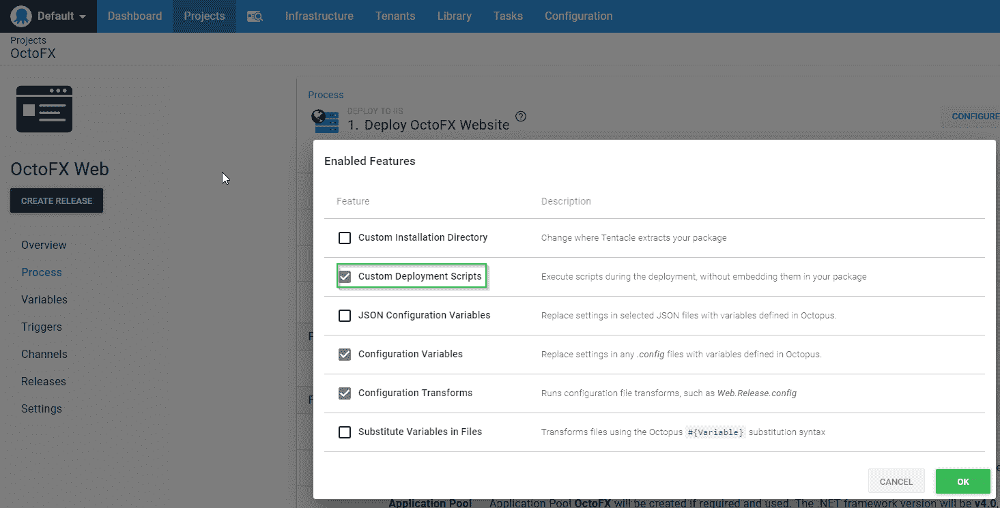
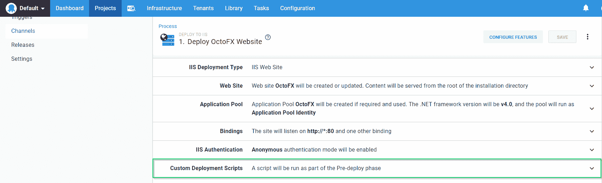

# 验证 AppSettings 或变量替换- Octopus 部署

> 原文：<https://octopus.com/blog/verify-appsettings-or-variable-replacement>

## 介绍

没有什么比部署过程中出现意外更糟糕的了，见鬼，这也是 Octopus Deploy 存在的原因之一！为了应对意外情况，Octopus Deploy 通过确保不同环境之间的部署过程始终相同来提供一致性和可靠性。然而，当部署到不同的环境时，有一件事是可以改变的，那就是变量。由于变量可以从一个环境改变到下一个环境，我们需要检查我们是否拼写了相同的变量，并相应地确定了它们的范围。这篇文章提供了一些如何在部署步骤中检测缺失或未改变的变量的例子。

## 。网。配置文件

. config 文件中的值通常需要根据软件部署的环境而有所不同，例如连接字符串或应用程序设置。这些。配置文件通常由可能无法访问 Octopus Deploy 的开发人员维护。在这种情况下，很容易错过变量的更新或添加，直到应用程序部署到生产环境中，问题才可能被注意到。

### 检查所有应用程序设置

任何提供预先部署脚本特性的步骤模板都可以与这个解决方案一起工作。对于本例，我们将使用部署到 IIS 步骤模板。将部署到 IIS 步骤添加到流程中后，单击配置功能按钮:

[](#)

接下来，启用定制部署脚本特性:

[](#)

现在，展开步骤模板的自定义部署脚本部分:

[](#)

在“预先部署脚本”窗口中输入以下代码:

```
# Get the config file
$configFile = Get-ChildItem -Path $OctopusParameters['Octopus.Action.Package.InstallationDirectoryPath'] | Where-Object {$_.Name -eq "web.config"}

# Create FileMap object
$fileMap = New-Object System.Configuration.ExeConfigurationFileMap

# Set location of exe config file
$fileMap.ExeConfigFilename = $configFile.FullName

# Create Configuration Manager object
$configManager = [System.Configuration.ConfigurationManager]::OpenMappedExeConfiguration($fileMap, [System.Configuration.ConfigurationUserLevel]::None)

# Iterate through appSettings collection
foreach($appSetting in $configManager.AppSettings.Settings)
{
    # Check to see if key is present
    if (!$OctopusParameters.ContainsKey($appSetting.Key))
    {
        # Fail the deployment
        throw "Octopus Parameter collection does not contain a value for $($appSetting.Key)"
    }
} 
```

就是这样！现在，在部署步骤之前，我们检查以确保所有的应用程序设置键都存在于 Octopus 参数集合中，如果没有找到，则部署失败！

### 静态 App 设置呢？

奇妙的问题！只有当您将所有应用程序设置都定义为 Octopus Deploy 变量时，上面的例子才有效。在很多情况下，你有一个永远不会改变的应用程序设置的静态列表，让它们成为变量是没有意义的。为此，我们仍然可以使用相同的方法，但是要调整它以排除一个键值列表:

```
# Define array of app settings to ignore
$settingsToIgnore = @("somesetting", "someothersetting")

# Get the config file
$configFile = Get-ChildItem -Path $OctopusParameters['Octopus.Action.Package.InstallationDirectoryPath'] | Where-Object {$_.Name -eq "web.config"}

# Create FileMap object
$fileMap = New-Object System.Configuration.ExeConfigurationFileMap

# Set location of exe config file
$fileMap.ExeConfigFilename = $configFile.FullName

# Create Configuration Manager object
$configManager = [System.Configuration.ConfigurationManager]::OpenMappedExeConfiguration($fileMap, [System.Configuration.ConfigurationUserLevel]::None)

# Iterate through appSettings collection
foreach($appSetting in $configManager.AppSettings.Settings)
{
    # Check to see if key is present
    if ((!$OctopusParameters.ContainsKey($appSetting.Key)) -and ($settingsToIgnore -notcontains $appSetting.Key))
    {
        # Fail the deployment
        throw "Octopus Parameter collection does not contain a value for $($appSetting.Key)"
    }
} 
```

这个版本的代码将忽略在`$settingsToIgnore`数组中定义的任何设置。这样你就忽略了所有你不关心的东西，但是抓住了任何可能已经被添加的新东西。

## 替换文件中的变量

处理变量时的另一个常见问题是文件中的替代变量特性。当使用替换文件中的变量特性时，如果 Octopus Deploy 在集合中有匹配的变量，它将只替换文件中的变量占位符。如果文件中的占位符在集合中没有匹配的变量，Octopus Deploy 不会警告您。可以想象，这可能会很成问题。

变量替换发生在部署阶段，所以在这种情况下我们不能使用预先部署组件。好消息是，部署自定义脚本在预部署之后、步骤处理之前执行，因此在部署到 IIS 步骤交换到新创建的文件夹之前，我们仍然可以使部署失败(注意，如果您使用自定义安装目录，这可能无法按预期工作)。与之前一样，我们将展开部署到 IIS 步骤的自定义部署脚本部分，并将以下代码粘贴到部署脚本窗口中:

```
function CheckSubstitutions($file)
{
    Write-Output "Verifying file $file"

    # Check to make sure file exists
    if ((Test-Path -Path "$file" -PathType leaf) -eq $true)
    {       
        # Read file
        $stringData = Get-Content -Path "$file" -Raw

        # Find placeholders
        $placeholders = [regex]::Matches($stringData, "(#{.*?})")

        # Check for token
        if ($placeholders.Count -gt 0)
        {
            # Something wasn't transformed
            throw "$file still contains #{} syntax. $placeholders"
        }
    }
    else
    {
        # Display message
        Write-Output "Unable to find file $file."
    }
}

# Get list of files that were specified for substitution
$fileList = $OctopusParameters['Octopus.Action.SubstituteInFiles.TargetFiles'].Split([Environment]::NewLine)

# Get base install path
$basePath = $OctopusParameters['Octopus.Action.Package.InstallationDirectoryPath']

# Ensure basePath ends with a \
if (!$basePath.EndsWith("\"))
{
    # Add ending slash
    $basePath += "\"
}

# Loop through list of files that were marked for substitution
foreach ($file in $fileList)
{
    if ($file -Match "\*")
    {
        Write-Output "$file contains wildcard. Get files by mask $($basePath + $file)"
        $files = Get-ChildItem -Path "$($basePath + $file)"

        foreach ($childFile in $files)
        {
            CheckSubstitutions($childFile)
        }
    }
    else
    {
        CheckSubstitutions($($basePath + $file))
    }
} 
```

现在你知道了！现在，您可以主动验证文件的占位符是否被替换为值！

## 结论

范围和拼写错误总是困扰任何自动化部署系统的变量组件。这篇文章中提供的例子应该有助于缓解常见的问题。

愉快的部署！