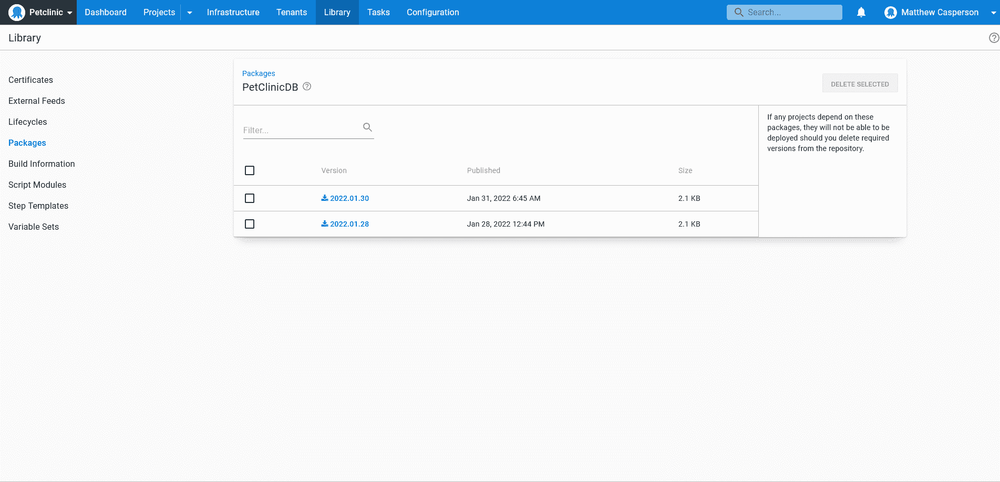
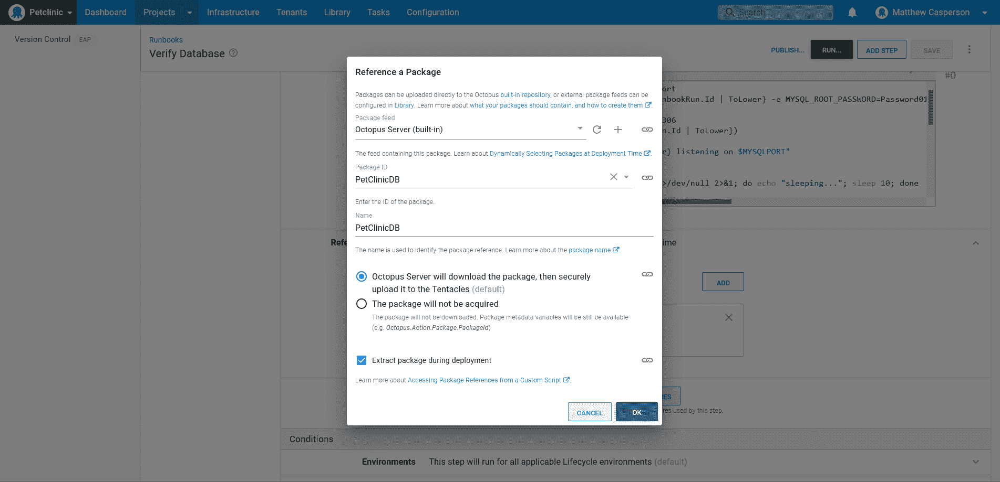
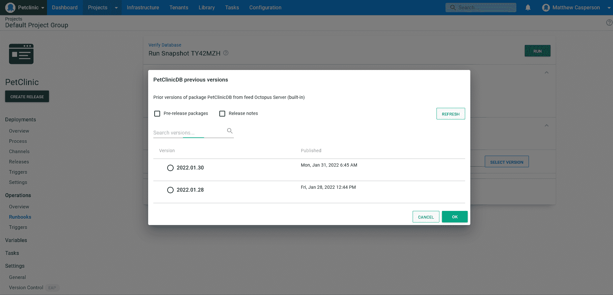

# 使用运行手册验证备份- Octopus Deploy

> 原文：<https://octopus.com/blog/verifying-backups-with-runbooks>

如今，是否应该备份已经不再是一个问题。对于任何认识到数据价值的现代组织来说，定期备份程序都是不可或缺的。许多组织甚至将他们的备份介质转移到另一个站点，以确保一个位置的物理灾难不会破坏他们的数据。

但不太常见的是强大的备份验证流程。备份恢复过程的细微之处通常只有在灾难发生时才能解决。也正是在灾难发生时，组织发现自己怀疑是否以正确的格式备份了正确的数据。不用说，这些都不是 DevOps 人员在危机期间试图恢复运营时想要面对的问题。

Runbooks 为这些问题提供了一个便捷的解决方案。通过在一次性环境中自动执行并定期执行恢复备份的过程，DevOps 团队可以确信他们的备份是有效的，并且恢复系统的过程是经过充分演练的。

几年前，我们发布了一个[博客系列，记录了为 Java 应用](https://octopus.com/blog/java-ci-cd-co/from-jar-to-docker)构建 CI/CD 和操作管道的过程。本系列的最后是一个旨在备份 MySQL 数据库的 runbook。虽然这是一个很有价值的建议，但这篇文章犯了同样的错误，认为创建一个备份并将其保存在异地就是故事的结尾。

在这篇文章中，您将学习如何通过在定制的 runbook 中使用真实的 MySQL 数据库来验证备份，从而完成备份周期。

## 查看运行手册

这篇文章中描述的 runbook 已经被部署到这个公共的 Octopus 实例中。点击**我是客人**查看操作手册和之前执行产生的输出。

## 将备份视为可部署的工件

在[上一篇文章](https://octopus.com/blog/java-ci-cd-co/from-cd-to-co)中描述的数据库被部署到一个 Kubernetes 集群中。如前一篇文章所述，执行备份的过程包括在 MySQL 容器中运行`mysqldump`客户端，转储数据库表，并将结果文件上传到一个更永久的位置。那个地方是一个 S3 桶。

然而，验证备份文件意味着像对待任何其他可部署的工件一样对待它。用于部署您的应用程序的工件被版本化并保存在允许查询和比较版本的存储库中。从概念上讲，您的数据库备份应该只是另一个可部署和版本化的工件，随时可以被 runbook 查询和使用。

在实践中，备份工件需要上传到存储库，而不是简单的文件存储。这并不意味着不再使用像 S3 这样的服务，因为你可以很容易地[将 S3 格式化为一个专家知识库](https://octopus.com/blog/hosting-maven-in-s3)。然而，出于本文的目的，您将备份文件直接上传到 Octopus 内置提要。

您可以使用 Octopus CLI 最轻松地将文件上传到 Octopus。下面的`Dockerfile`在 MySQL 服务器旁边安装 Octopus 和 AWS CLIs:

```
FROM mysql
RUN apt-get update; apt-get install python python-pip -y
RUN pip install awscli
RUN apt update && apt install --no-install-recommends gnupg curl ca-certificates apt-transport-https -y && \
curl -sSfL https://apt.octopus.com/public.key | apt-key add - && \
sh -c "echo deb https://apt.octopus.com/ stable main > /etc/apt/sources.list.d/octopus.com.list" && \
apt update && apt install octopuscli -y 
```

## 备份数据库

下面的 Bash 脚本定位名称以“mysql”开头的第一个 pod，执行`mysqldump`以执行备份，使用 Octopus CLI 将 sql 文件打包为工件，并将工件推送到 Octopus 服务器:

```
POD=$(kubectl get pods -o json | jq -r '[.items[]|select(.metadata.name | startswith("mysql"))][0].metadata.name')
VERSION=$(date +"%Y.%m.%d")
kubectl exec $POD -- /bin/sh -c 'cd /tmp; mysqldump -u root -p#{MySQL Password} petclinic > dump.sql 2> /dev/null'
kubectl exec $POD -- /bin/sh -c "cd /tmp; octo pack --overwrite --include dump.sql --id PetClinicDB --version ${VERSION} --format zip"
kubectl exec $POD -- /bin/sh -c "cd /tmp; octo push --package PetClinicDB.${VERSION}.zip --overwrite-mode OverwriteExisting --server https://tenpillars.octopus.app --apiKey #{Octopus API Key} --space #{Octopus.Space.Name}" 
```

这个脚本的最终结果是 Octopus 内置提要中的版本化备份工件:

[](#)

## 验证备份

既然您的数据库备份已经版本化并上传到存储库，就像任何其他可部署的工件一样，在 runbooks 中使用它们变得更加容易。下一步是自动化在短暂(一次性)环境中验证备份的过程。

Docker 提供了一个完美的平台来启动和关闭一个测试数据库。这是因为 Docker 容器在设计上是独立和自包含的，允许您协调备份恢复并在事后清理一切。

下面的 Bash 脚本执行以下操作:

*   创建一个 MySQL Docker 容器
*   暴露主机上随机端口的内部端口 3306
*   提取随机端口号
*   等待 MySQL 服务器启动
*   还原备份
*   在数据库中查询已知要包括在备份中的记录
*   移除 Docker 容器
*   验证先前 SQL 查询的结果

```
# Run docker mapping port 3306 to a random port
docker run -p 3306 --name mysql-#{Octopus.RunbookRun.Id | ToLower} -e MYSQL_ROOT_PASSWORD=Password01! -d mysql

# Extract the random port Docker mapped to 3306
PORT=$(docker port mysql-#{Octopus.RunbookRun.Id | ToLower})
IFS=: read -r BINDING MYSQLPORT <<< "$PORT"
echo "mysql-#{Octopus.RunbookRun.Id | ToLower} listening on $MYSQLPORT"

echo "Waiting for MySQL to start"
while ! echo exit | nc localhost $MYSQLPORT >/dev/null 2>&1; do echo "sleeping..."; sleep 10; done
echo "Sleep a little longer to allow MySQL to finish booting"
sleep 20

echo "Restoring the database"
docker exec mysql-#{Octopus.RunbookRun.Id | ToLower} mysql -u root -p#{MySQL Password} -e "CREATE DATABASE petclinic;" 2>/dev/null
cat PetClinicDB/dump.sql | docker exec -i mysql-#{Octopus.RunbookRun.Id | ToLower} /usr/bin/mysql -u root -p#{MySQL Password} petclinic 2>/dev/null

echo "Query the database"
COUNT=$(docker exec mysql-#{Octopus.RunbookRun.Id | ToLower} mysql -u root -p#{MySQL Password} petclinic -s -e "select count(*) from owners;" 2>/dev/null)
echo "Table owners has $COUNT rows"

echo "Shutting the container down"
docker stop mysql-#{Octopus.RunbookRun.Id | ToLower}
docker rm mysql-#{Octopus.RunbookRun.Id | ToLower}

if [[ "$COUNT" -eq 0 ]]; then
    # If there were no rows returned, something went wrong and the backup is not valid
    exit 1
fi 
```

该脚本作为常规的**运行脚本**步骤在 runbook 中运行，并带有下载 SQL 备份工件的附加包引用:

[](#)

像引用任何其他可部署工件一样引用备份允许您在创建 runbook 运行时选择要验证的备份，或者默认接受最新版本:

[](#)

## 结论

备份的好坏取决于它们的恢复能力，但往往在危机期间才发现恢复备份的细微之处，这让 DevOps 团队怀疑备份是否包含正确格式的正确数据。

通过像对待任何其他可部署工件一样对待备份工件，并自动化恢复和验证备份数据的流程，DevOps 团队可以将他们的恢复流程作为常规备份生命周期的一部分进行优化，并确信他们可以从任何涉及数据丢失的场景中快速恢复。

在本文中，您看到了生成数据库备份、将它们上传到工件存储库、将备份作为可部署工件使用，以及验证将数据恢复到短暂环境的过程的示例操作手册。最终结果是，备份工作流将数据恢复视为另一项例行的自动化任务。

阅读我们的 [Runbooks 系列](https://octopus.com/blog/tag/Runbooks%20Series)的其余部分。

愉快的部署！