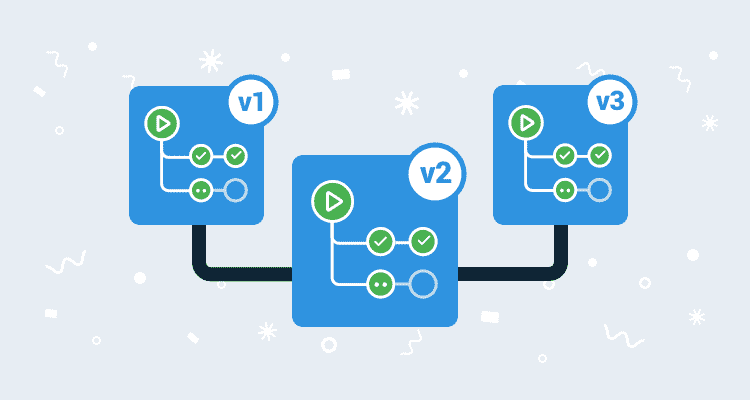

# 向 GitHub 操作添加版本- Octopus Deploy

> 原文：<https://octopus.com/blog/versioning-with-github-actions>

[](#)

GitHub Actions 正在以测试版的形式慢慢向用户推出。这个新特性让 GitHub 用户可以使用 GitHub 管理的基础设施直接从他们的代码中执行构建和部署。这为开发人员提供了很多机会，但是尽管动作非常强大和灵活，我还是立即遇到了版本控制的问题。

通常，CI 系统会包含某种递增计数器，可以用作任何构建的补丁发布。这意味着每个构建都会被自动分配一个新的编号，并且任何产生的工件都会继承一个有意义的版本。不幸的是，在 GitHub Actions 的当前测试版中，没有相当于构建号的内容。构建环境公开了[信息，如 Git SHAs、存储库、用户和事件](https://developer.github.com/actions/creating-github-actions/accessing-the-runtime-environment/)，但没有构建号。

这是不方便的，至少可以说，但有一个解决方案。

## 实现 GitVersion

[GitVersion](https://gitversion.readthedocs.io/en/latest/) 是一个基于 Git 存储库中的标签生成 SemVer 版本号的工具。GitVersions 非常适合与 GitHub 操作一起使用，因为 Git 存储库本身就是版本控制的真实来源，除了 Git 客户端之外，不需要任何特殊工具来管理版本号。

GitVersion 还提供了一个 [Docker 镜像](https://hub.docker.com/r/gittools/gitversion/)，GitHub 动作可以直接使用。

这意味着，理论上，作为 GitHub Actions 工作流的一部分，我们拥有生成有意义的版本号所需的一切。然而在实践中，我们仍然有一些困难要克服。

## GitHub 动作和共享变量

GitHub Actions 基于个人工作的理念。这些作业可以在底层虚拟机上运行，也可以在 Docker 容器中运行。以这种方式构建提供了很大的灵活性，但是不利的一面是，很难获取一项工作的输出并在另一项工作中使用它。CI 服务器通常通过用特殊标记捕获输出来解决这个问题。例如，TeamCity 可以观察格式为`##teamcity[setParameter name='env.whatever' value='myvalue']`的输出，并创建一个变量作为响应。不幸的是，GitHub Actions 的 beta 版不提供任何传递变量的支持。

我们在作业之间共享的是文件系统。直接在 VM 上运行的作业可以访问路径`/home/runner/work/RepoName/RepoName/`(其中`RepoName`被替换为 GitHub 库的名称)。对接作业具有安装到`/github/workspace`的相同路径。

我们可以使用这个共享文件系统来保存 GitVersion 生成的版本，然后在后面的步骤中消耗它。

## 示例构建

要了解这在实践中是如何工作的，请看下面的工作流定义。这是一个构建 Python AWS Lambda 应用程序的项目示例:

```
name: Python package

on: [push]

jobs:
  build:
    runs-on: ubuntu-latest
    steps:
    - uses: actions/checkout@v1
    - name: Get Git Version
      uses: docker://gittools/gitversion:5.0.2-beta1-27-linux-centos-7-netcoreapp2.2
      with:
        args: /github/workspace /nofetch /exec /bin/sh /execargs "-c \"echo $GitVersion_FullSemVer > /github/workspace/version.txt\""
    - name: Set up Python 3.7
      uses: actions/setup-python@v1
      with:
        python-version: 3.7
    - name: Package dependencies
      run: |
        python -m pip install --upgrade pip
        cd hello_world
        pip download -r requirements.txt
        unzip \*.whl
        rm *.whl
        ls -la
    - name: Extract Octopus Tools
      run: |
        mkdir /opt/octo
        cd /opt/octo
        wget -O /opt/octo/octopus.zip https://download.octopusdeploy.com/octopus-tools/6.12.0/OctopusTools.6.12.0.portable.zip
        unzip /opt/octo/octopus.zip
        chmod +x /opt/octo/Octo
    - name: Pack Application
      run: >-
        /opt/octo/Octo pack .
        --outFolder /home/runner/work/AWSSamExample/AWSSamExample
        --basePath /home/runner/work/AWSSamExample/AWSSamExample/hello_world
        --id AwsSamLambda
        --version $(cat /home/runner/work/AWSSamExample/AWSSamExample/version.txt)
        --format zip
    - name: Push to Octopus
      run: >-
        /opt/octo/Octo push
        --server ${{ secrets.MATTC_URL }}
        --apiKey ${{ secrets.MATTC_API_KEY }}
        --package /home/runner/work/AWSSamExample/AWSSamExample/AwsSamLambda.$(cat /home/runner/work/AWSSamExample/AWSSamExample/version.txt).zip
        --overwrite-mode IgnoreIfExists 
```

这个工作流的第一个有趣的部分是我们调用 GitVersion docker 映像的地方。

这里的技巧是调用 GitVersion，将生成的 SemVer 版本保存到一个文件中，而不是打印到控制台输出中。我们通过将`/exec`参数设置为`/bin/sh`，并将`/execargs`参数设置为`"-c \"echo $GitVersion_FullSemVer > /github/workspace/version.txt\""`来实现这一点。这些选项导致 GitVersion 执行 shell，shell 将环境变量`GitVersion_FullSemVer`(由 GitVersion 为我们定义)的值写入文件`/github/workspace/version.txt`。

该作业的最终结果是一个名为`/github/workspace/version.txt`或`/home/runner/work/RepoName/RepoName/version.txt`的文件，这取决于该作业是否在 Docker 容器中运行。

环境变量`$GitVersion_FullSemVer`只是 GitVersion 提供的众多变量之一。下面 JSON 中的任何字段都可以以`GitVersion_`为前缀，并作为环境变量读取。

```
{                                                           
  "Major":0,
  "Minor":1,
  "Patch":0,
  "PreReleaseTag":"",
  "PreReleaseTagWithDash":"",
  "PreReleaseLabel":"",
  "PreReleaseNumber":"",
  "WeightedPreReleaseNumber":"",
  "BuildMetaData":55,
  "BuildMetaDataPadded":"0055",
  "FullBuildMetaData":"55.Branch.master.Sha.3903750b2aa5d84fd6004b2244cdb491f45520d9",
  "MajorMinorPatch":"0.1.0",
  "SemVer":"0.1.0",
  "LegacySemVer":"0.1.0",
  "LegacySemVerPadded":"0.1.0",
  "AssemblySemVer":"0.1.0.0",
  "AssemblySemFileVer":"0.1.0.0",
  "FullSemVer":"0.1.0+55",
  "InformationalVersion":"0.1.0+55.Branch.master.Sha.3903750b2aa5d84fd6004b2244cdb491f45520d9",
  "BranchName":"master",
  "Sha":"3903750b2aa5d84fd6004b2244cdb491f45520d9",
  "ShortSha":3903750,
  "NuGetVersionV2":"0.1.0",
  "NuGetVersion":"0.1.0",
  "NuGetPreReleaseTagV2":"",
  "NuGetPreReleaseTag":"",
  "VersionSourceSha":"0f692a38449b853d8a04aa891ac48e63ebec1add",
  "CommitsSinceVersionSource":55,
  "CommitsSinceVersionSourcePadded":"0055",
  "CommitDate":"2019-08-21"
} 
```

```
- name: Get Git Version
  uses: docker://mcasperson/gitversion:5.0.2-linux-centos-7-netcoreapp2.2
  with:
    args: /github/workspace /nofetch /exec /bin/sh /execargs "-c \"echo $GitVersion_FullSemVer > /github/workspace/version.txt\"" 
```

为了使用该版本，我们将使用 [Octopus CLI 工具](https://octopus.com/docs/octopus-rest-api/octopus-cli)。在以下作业中，我们下载并解压缩 CLI 包，以便在后续步骤中使用。

Octopus CLI 工具也可以作为 [Docker image](https://hub.docker.com/r/octopusdeploy/octo) 使用，因此我们可以使用`uses: docker://octopusdeploy/octo:6.12.0`工作流中的这些工具。然而，直接调用 docker images 会使使用 shell 扩展变得困难，我们需要提取文件`version.txt`的内容，并将其作为命令行参数传递。这就是我们在本地提取工具的原因:

```
- name: Extract Octopus Tools
  run: |
    mkdir /opt/octo
    cd /opt/octo
    wget -O /opt/octo/octopus.zip https://download.octopusdeploy.com/octopus-tools/6.12.0/OctopusTools.6.12.0.portable.zip
    unzip /opt/octo/octopus.zip
    chmod +x /opt/octo/Octo 
```

提取 Octopus CLI 工具后，我们可以调用它们来打包应用程序。请注意我们如何使用带有参数`--version $(cat /home/runner/work/AWSSamExample/AWSSamExample/version.txt)`的 shell 扩展来读取 GitVersion 创建的`version.txt`文件的值(`AWSSamExample`是我的 GitHub repo 的名称)。这是我们在作业之间传递变量的方式:

```
- name: Pack Application
  run: >-
    /opt/octo/Octo pack .
    --outFolder /home/runner/work/AWSSamExample/AWSSamExample
    --basePath /home/runner/work/AWSSamExample/AWSSamExample/hello_world
    --id AwsSamLambda
    --version $(cat /home/runner/work/AWSSamExample/AWSSamExample/version.txt)
    --format zip 
```

我们以类似的方式使用 Octopus CLI 将生成的应用程序推送到 Octopus 服务器:

```
- name: Push to Octopus
  run: >-
    /opt/octo/Octo push
    --server ${{ secrets.MATTC_URL }}
    --apiKey ${{ secrets.MATTC_API_KEY }}
    --package /home/runner/work/AWSSamExample/AWSSamExample/AwsSamLambda.$(cat /home/runner/work/AWSSamExample/AWSSamExample/version.txt).zip
    --overwrite-mode IgnoreIfExists 
```

## 结论

GitHub 动作对开发者来说是一个强大的新功能，但是在测试版中有一些粗糙的边缘，你必须在生产场景中解决。GitVersion 为缺乏构建号提供了一个简洁的解决方案，并允许 GitHub actions 与 Octopus 等平台进行交互。