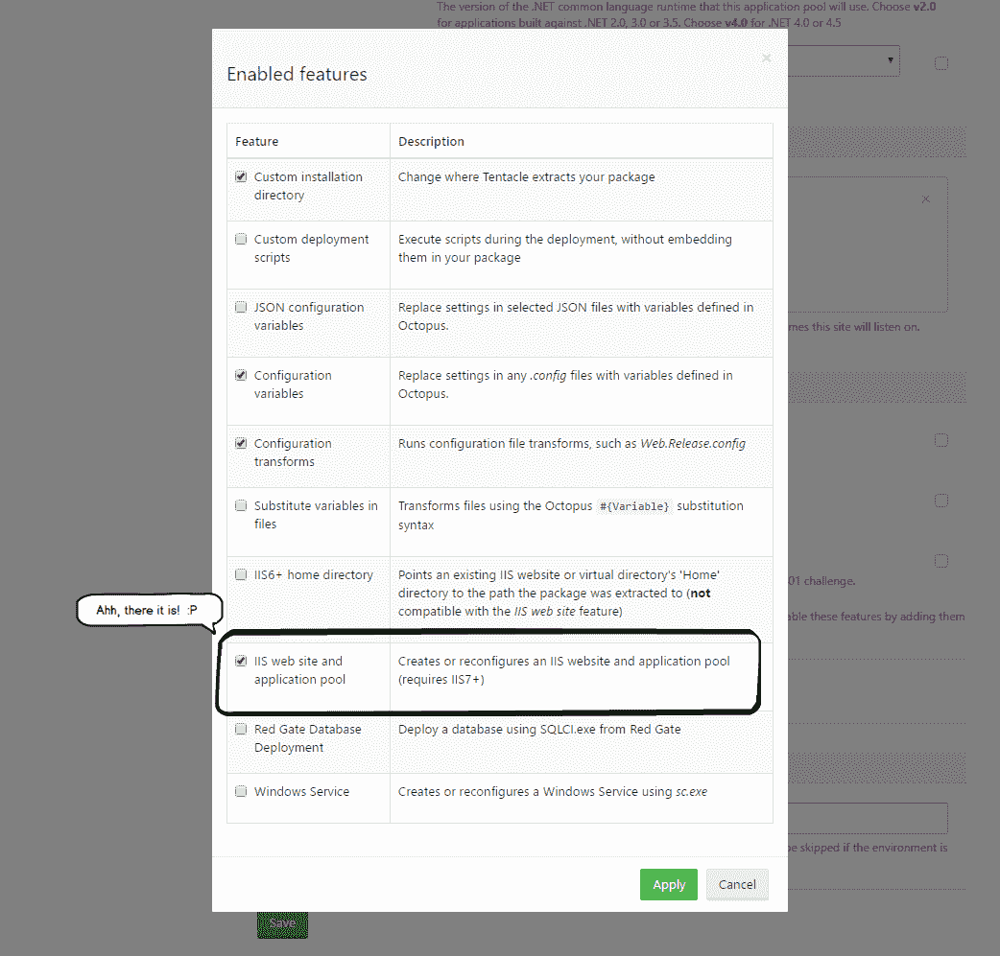
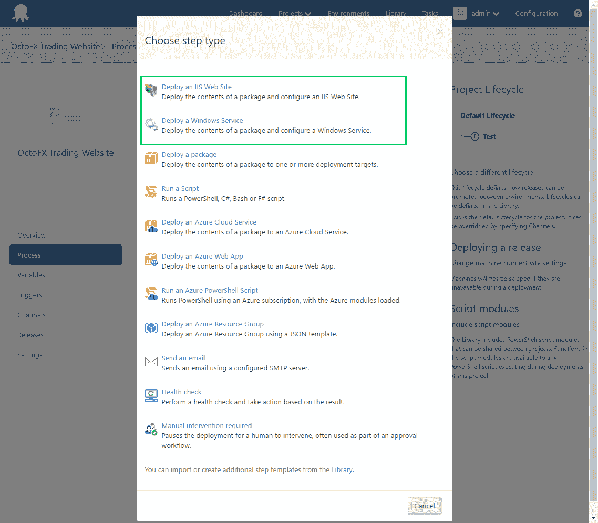
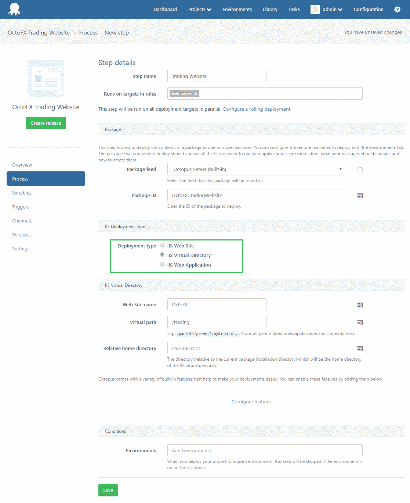
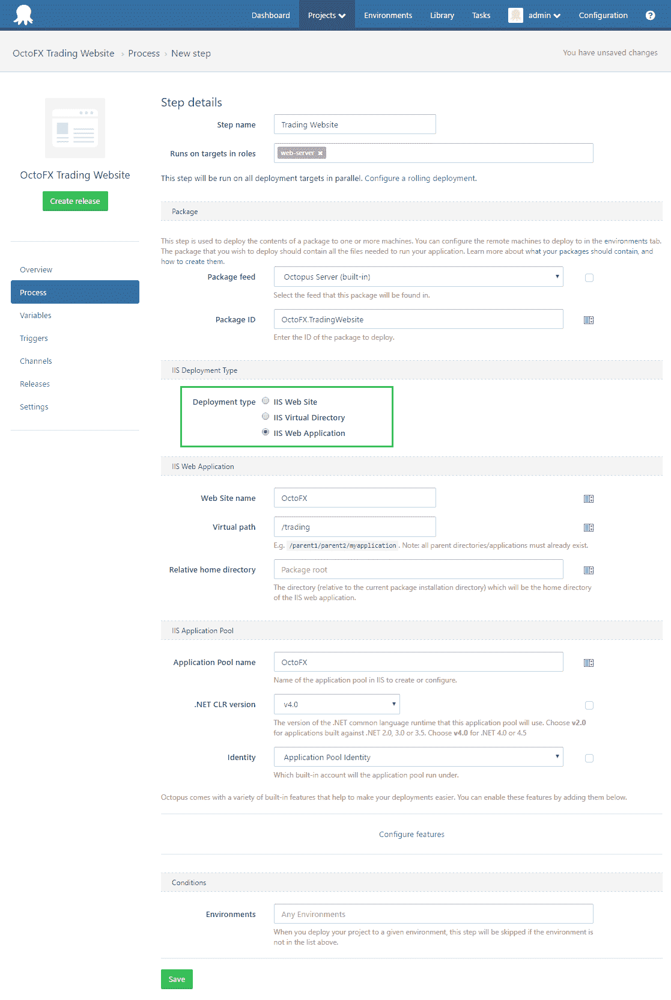

# IIS 和 Windows 服务步骤，包括虚拟目录支持- Octopus 部署

> 原文：<https://octopus.com/blog/virtual-dir-iis-windows-service-steps>

在 Octopus Deploy [3.4.7](https://octopus.com/downloads) 中，我们添加了:

## IIS 和 Windows 服务部署步骤

部署 IIS 网站和 Windows 服务是我们的核心能力；我们的面包和黄油；我们存在的理由。
这是我们的工作。

然而，在 Octopus 中配置 IIS 或 Windows 服务部署步骤(直到现在)还有些模糊。
以前，必须创建一个*部署包*步骤，点击*配置特性*，并启用相关特性。

我们意识到(尤其是对于那些第一次与 Octopus 互动的人来说)这种体验并没有想象中那么直观。

因此，我们添加了两种新的部署步骤类型:

现有的*部署包*步骤仍然可用。现有部署流程不会受到任何影响。

我们希望在添加部署步骤时，这些步骤能够更好地符合用户的目标。

## 支持部署到虚拟目录和 Web 应用程序

我们当前的任务之一是提供世界上最棒的 IIS 部署体验。

当我们考虑如何改进我们的 IIS 功能时，我们发现的第一个缺口(尽管这个缺口已经被我们的[社区库](https://library.octopusdeploy.com)很好地填补了)是对虚拟目录和 Web 应用程序的支持。

现在，当部署到 IIS 时，您可以选择:

*   IIS 网站
*   IIS 虚拟目录
*   IIS Web 应用程序

### 虚拟目录示例

### Web 应用程序示例

一如既往，欢迎所有反馈。请告诉我们你的想法。