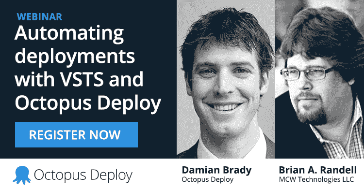

# 网络研讨会:使用 VSTS 和 Octopus Deploy 实现自动化部署- Octopus Deploy

> 原文：<https://octopus.com/blog/webinar-automating-deployments-vsts-octopus>

**更新:[点击此处观看录制的网络研讨会！](https://www.youtube.com/watch?v=IGKRPfWaDiE)**

如果您正在阅读这篇博客，您可能已经使用 Octopus Deploy 作为部署管道的一部分。在过去的几年里，我们付出了很大的努力，使其易于与您现有的构建引擎集成。

如果您正在使用 Visual Studio Team Services，我们希望向您展示这种集成变得多么容易！

## 集成的历史选项

长期以来，OctoPack 一直提供一种简单的方法来打包你的应用程序，并把它们推给 Octopus，为了以编程方式创建和部署版本，你可以使用 octo.exe 的 T2、API 和各种插件 T3。

TeamCity 用户已经有一个很棒的 Octopus 插件有一段时间了，但是直到最近，对于那些大量投资于全微软 ALM 堆栈的用户来说，这个选项还有点复杂。

但是事情变了！

## Octopus 部署在 Visual Studio 市场中

微软已经在 Visual Studio Team Services 方面做了一些很好的工作，在此基础上，我们已经能够为该生态系统中的团队创建并发布一个真正有用的扩展。

在 VSTS(和 TFS)的新构建和发布系统意味着 Octopus 作为构建或发布管道的一部分的一流集成。VSTS 其他地方的扩展点意味着增加更多的机会！

简而言之，VSTS 和 Octopus Deploy 为端到端开发运维提供了一个引人注目的故事——从需求和工作项目一直到生产中运行的软件。

* * *

## 加入网络研讨会！

为了展示 VSTS 和 Octopus Deploy 的良好合作，我们将与 Brian A. Randell 和 Damian Brady 举办一次网络研讨会！

时间:3 月 21 日星期二，太平洋时间上午 9 点|美国东部时间下午 12 点([在我的时区，这是什么时间？](https://www.timeanddate.com/worldclock/fixedtime.html?msg=Automating+deployments+with+VSTS+and+Octopus+Deploy&iso=2017-03-21T16:00:00.0000000))

**我们将介绍的内容:**

*   安装延伸部分并连接到 Octopus
*   如何使用扩展提供的每个构建任务
*   设置内部版本的常用策略
*   发行说明的提示和技巧
*   最后:一个*新的*刚刚发布的扩展！

**关于布莱恩:**

Brian A. Randell 是一位著名的开发人员、演说家、作家和技术专家。他目前是咨询公司 MCW 技术有限责任公司的合伙人，也是 SaaS 教育平台公司 DuoMyth 的联合创始人。在超过 25 年的时间里，他一直在构建软件解决方案。他通过写作和培训向团队传授微软技术，既有面对面的也有按需提供的。他目前是 Visual Studio 和开发技术 MVP，专注于 DevOps、敏捷开发实践、虚拟化和 Microsoft Azure。不工作的时候，Brian 喜欢和他的妻子和两个孩子在一起，他们喜欢在 Xbox One 上让他看起来很糟糕(不管有没有 Kinect)。

确保你带着问题来，像往常一样，视频将在之后提供。

那里见！