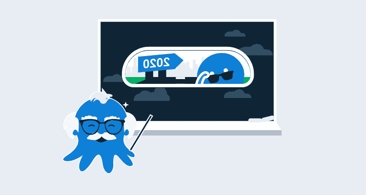

# 我们 2020 年最受欢迎的网络研讨会- Octopus Deploy

> 原文：<https://octopus.com/blog/webinar-of-the-year>

网络研讨会是我们为客户和更广泛的 DevOps 社区分享和深入探讨特定主题的一种方式。在这篇文章中，我将看看我们如何举办网络研讨会，我们如何在 2020 年改进它们，以及如果你在假期工作并寻找一些公司，我们的主要建议。

您可以在 YouTube [网络研讨会播放列表](https://www.youtube.com/watch?v=AjQhW5lC4Qs&list=PLAGskdGvlaw2ph_YPvMquJlzgYd7bEDba)上找到我们所有的 29 场网络研讨会。

## 2020 年顶级网络研讨会

在这一部分，我将列出一些我个人最喜欢的，以及章鱼投票选出的 2020 年最喜欢的。

### 将微服务容器部署到 Kubernetes

Kubernetes 是 DevOps 的热门话题。在本次网上技术交流讲座中，Shawn Sesna 向您介绍了 Kubernetes 的 101 项内容，以及如何使用 Octopus Deploy 来管理您的容器、pod、部署和变量管理。我们涵盖以下主题:

*   [Kubernetes](https://octopus.com/docs/deployment-examples/kubernetes-deployments/deploy-container) 的基本概念。
*   使用 Octopus Deploy 将一个现有的应用程序部署为一个容器。
*   了解 Octopus 如何在您从开发到测试再到生产环境的部署过程中自动更新您的 web 应用程序配置。

[https://www.youtube.com/embed/mj2oNBIYetc](https://www.youtube.com/embed/mj2oNBIYetc)

VIDEO

### 使用 AWS 和 runbooks 进行服务器配置

当从 [AWS](https://aws.amazon.com) 上的 [Cloudformation](https://aws.amazon.com/cloudformation/) 和[章鱼手册](https://octopus.com/docs/runbooks)开始时，有很多东西让你摸不着头脑。CloudFormation 是一项强大的技术，它使得在 AWS 中按需提供和销毁基础设施变得很容易。我们涵盖以下主题:

*   如何使用 Runbook Automation 供应和拆除 Linux 服务器
*   如何通过 runbook 调度节省云计算成本
*   如何将 CloudFormation 模板部署到 AWS
*   如何在新的基础设施上将 Java web 应用程序部署到 Tomcat

[https://www.youtube.com/embed/6cKhypLE11I](https://www.youtube.com/embed/6cKhypLE11I)

VIDEO

### 具有 runbook 自动化功能的实用自助开发工具

DevOps 是将团队聚集在一起进行协作。这在现实生活中说起来容易做起来难，因为开发和运营团队通常有不同的优先级。

开发团队希望快速交付代码并快速修复问题，而运营团队希望提供稳定可靠的 IT 服务。事实没有单一的来源，工具经常碍手碍脚，强化了信息孤岛。

Octopus 中的 Runbook Automation 允许开发和运营团队合作，在不牺牲生产控制的情况下实现日常维护和自助服务的自动化。我们讨论了以下主题:

*   开发运维自动化如何打破开发和运维之间的孤岛
*   runbook 自动化和自助操作简介
*   如何使用 Azure 资源管理器模板供应云基础架构
*   如何使用 Octopus Runbooks 管理您的数据库维护

[https://www.youtube.com/embed/HjXl_Vz6uu0](https://www.youtube.com/embed/HjXl_Vz6uu0)

VIDEO

### 2020 年:章鱼年

2020 年是全球面临独特挑战的一年。虽然世界已经天翻地覆，但我们一直在努力改进 Octopus，增加了一些很棒的新功能，并根据客户反馈进行了一些小的改进。在本次网络研讨会中，我们讨论了以下主题:

*   2020 年的独特技术挑战
*   2020 年发布的主要功能
*   运行手册
*   更简单的 Java 支持
*   增强的集成和跨平台支持
*   更好的依赖性管理

[https://www.youtube.com/embed/apxzK-rDHIc](https://www.youtube.com/embed/apxzK-rDHIc)

VIDEO

### 塑造章鱼工程

章鱼在过去的几年里成长了很多。我们从 2015 年的 10 名澳大利亚人发展到 2020 年的近 100 人，团队成员分布在英国和美国。这种增长并非没有挑战。

随着我们工程团队的成长，我们期望我们的产品和新特性会随着团队一起增加。事实是，随着我们增加工程师和发布更复杂的功能，相反的事情发生了。

在 2019 年年中，在我们发布 Spaces 后不久，我们开始考虑并采用 [Basecamp Shape-Up](https://basecamp.com/shapeup) 模型，这有助于我们获得更多专注的开发时间，消除中断，让我们有更多时间提前了解功能。在本次网络研讨会中，我们讨论了以下主题:

*   我们的工程团队在成长过程中面临的问题
*   我们如何采用 Basecamp 的 Shape-up 开发方法来改进 Octopus 的开发和发布管理
*   我们在尝试改进软件交付方式时吸取的经验教训

[https://www.youtube.com/embed/AjQhW5lC4Qs](https://www.youtube.com/embed/AjQhW5lC4Qs)

VIDEO

## 摘要

我们已经在 2020 年举办了一些世界级的网络研讨会，我对我们在 2021 年将要做的事情感到兴奋，因为我们将推出一些很棒的新功能。

我们 2020 年第一季度的渠道已经满了，如果你对网络研讨会有什么想法，或者我们可以对网络研讨会进行改进，请发电子邮件至 Advice@Octopus.com联系我们。