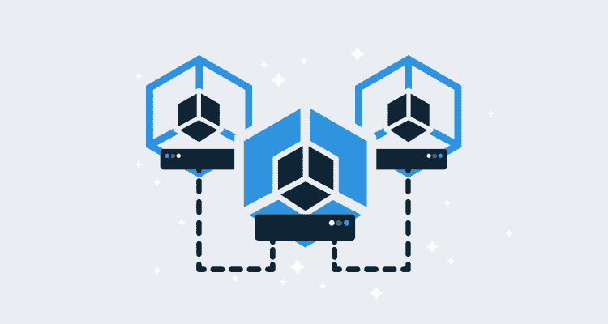

# 什么是服务网格？-章鱼部署

> 原文：<https://octopus.com/blog/what-is-a-service-mesh>

[](#)

如果你使用 Kubernetes 有一段时间，你会听到服务网格这个术语。几家大公司都在支持服务网格项目，比如谷歌和 Istio 以及云计算原生计算基金会和 T2 linker d T3。

那么什么是服务网格，它与 Kubernetes 本地的标准服务和入口资源有什么不同？

## 什么是服务网格？

有许多关于服务网格的描述，但是在视频[什么是服务网格](https://www.youtube.com/watch?v=rhPQHbKoyb8)中，我们听到了构建 LinkerD 的浮力公司的威廉·摩根和从事 Istio 项目的路易斯·瑞安的观点。

[https://www.youtube.com/embed/rhPQHbKoyb8](https://www.youtube.com/embed/rhPQHbKoyb8)

VIDEO

威廉·摩根将服务网格描述为:

> 专用于管理微服务应用中发生的服务对服务通信的基础设施层。我所说的管理是指事情的操作方面，比如可靠性特性[...]，有安全功能[...]以及可见性。

> 服务网格的目标是将这些东西作为基础设施的一部分提供给你，而不是必须在应用程序本身中完成。

路易斯·瑞安提出了这样的观点:

> 我们将其视为网络的抽象，因此应用程序必须减少对网络的考虑。希望运营商也能减少对网络结构的考虑，随着[...]部署规模增长。

那么，为什么要使用服务网格呢？

## 没有服务网的生活

为了理解我们为什么要使用服务网格，让我们首先看看网络功能是如何在单个应用程序中实现的。

处理微服务应用中的网络问题的标准解决方案是重试请求。假定 HTTP GETs 和 put 是等幂的，这些端点的消费者可以期望能够重试失败的网络调用。

有许多库可以让开发人员轻松实现这些重试。Spring retry 和 [Polly](https://github.com/App-vNext/Polly#retry) 就是两个这样的例子，它们都超越了简单的重试循环，提供了像可配置补偿公式这样的特性。

下面是 Spring 服务中的一个函数示例，它将使用自定义的退避公式重试网络调用。

```
@Retryable(maxAttempts=10,value=RuntimeException.class,backoff = @Backoff(delay = 10000,multiplier=2))
public Double getCurrentRate() {
  // ...
} 
```

Polly 提供了类似的重试逻辑:

```
Policy
  .Handle<SomeExceptionType>()
  .WaitAndRetry(
    5,
    retryAttempt => TimeSpan.FromSeconds(Math.Pow(2, retryAttempt)),
    (exception, timeSpan, context) => {
      // do something
    }
  ); 
```

这两个例子并不特别复杂，但可能允许代码在与它们使用的任何服务的瞬时连接故障中存活。正因如此，像这样的重试逻辑是非常常见的。

## 将网络逻辑移至网络层

虽然这种代码可能很普遍，但它的配置并不标准。你不能期望使用 Spring retry 库的 Java 代码与。NET 代码使用 Polly 库。

微服务模式的好处之一是每个服务都是用最适合其需求的语言编写的。即使您能控制自己编写的代码，任何规模合适的 Kubernetes 集群都会包含至少一些用您无法控制的语言编写的第三方服务。

同时，网络问题在整个集群中共享，并作为一个整体进行理想的配置。不幸的是，当集群中的应用程序是用多个配置方式略有不同的库编写的时，标准化像重试逻辑这样简单的事情就变得很困难。

将这些网络问题从应用程序转移到基础设施层意味着可以统一管理标准网络功能，如请求重试。具体来说:

*   Kubernetes 将利用任何安全或审计策略来维护配置。
*   标准的`kubectl`命令行工具现在用于查看或更新网络配置。
*   标准的 Kubernetes 仪表板可用于查看和管理网络配置。
*   运营商只需要了解少量服务网格的具体实施细节，而不是已经捆绑到部署的应用中的每一个网络库。

## 入口控制器和服务网格有什么区别？

Kubernetes 本机公开了[入口资源](https://kubernetes.io/docs/concepts/services-networking/ingress/)，用于引导来自(通常是共享的)负载均衡器的流量。网络流量被定向到一个 Kubernetes [服务](https://kubernetes.io/docs/concepts/services-networking/service/)，该服务又将流量定向到一个 Kubernetes Pod。

一个[入口控制器](https://kubernetes.io/docs/concepts/services-networking/ingress-controllers/)执行入口资源的实际网络处理，有[多个入口控制器可以从](https://kubernetes.io/docs/concepts/services-networking/ingress-controllers/#additional-controllers)中选择，如 Nginx、HAProxy、Traefik 等。像 Istio 这样的服务网格平台也扮演入口控制器的角色。

一些入口控制器由标准 Kubernetes 入口资源配置，一些通过它们自己的定制资源配置，一些由定制和 Kubernetes 入口资源配置。

例如，Nginx，一种更受欢迎的入口控制器，最近[宣布支持两种新的定制资源，称为 VirtualServer 和 VirtualServerRoute](https://www.nginx.com/blog/announcing-nginx-ingress-controller-for-kubernetes-release-1-5-0/) 。这些定制资源是入口控制器超越基线规范的一个例子。

因此，服务网格可以是入口控制器，并且入口控制器可以实现超出基线入口资源所定义的功能。这些模糊的界限意味着这两个概念之间没有明显的区别。我怀疑入口控制器和服务网格之间的区别将继续变得更加随意，因为平台会继续添加新的功能来区分自己。

## 结论

服务网格为 Kubernetes 提供了一致的基础设施层，具有丰富的网络监控、可靠性和安全特性。服务网格消除了每个应用程序公开该网络功能的需要，并且可以利用现有的 Kubernetes 安全性、CLI 工具、仪表板和审计来维护基础架构层。

虽然术语服务网格还没有很好的定义，但是随着时间的推移，我们希望看到类似服务网格的功能进入到今天被用作入口控制器的许多项目中。