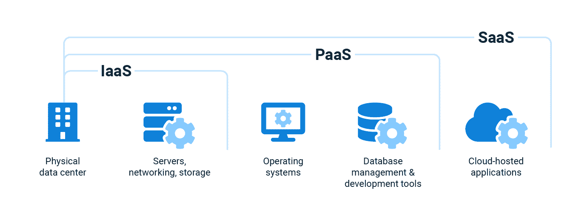

# 什么是云编排？-章鱼部署

> 原文：<https://octopus.com/blog/what-is-cloud-orchestration>

无论你在哪里工作，你可能已经注意到你使用的许多应用程序已经转移到了云端。从存储电子邮件或照片等数据，到在 Git 等云存储库中开发软件，云解决方案正在主导市场。Gartner 的一项研究表明，到 2025 年，云产品的收入将超过传统 IT 解决方案。

如果您使用云产品，您希望让它们更高效、更具成本效益。有两个过程可以帮助您做到这一点:

*   云流程编排
*   云自动化

这些概念经常互换使用，但它们在一些关键方面有所不同。

在这篇文章中，我将介绍云流程编排和云自动化之间的区别、各种“即服务”模型、云流程编排的好处、工具以及 Octopus Deploy 的适用范围。

## 云流程编排和云自动化之间的区别

云协调是指公共云和私有云环境中工作负载、资源和基础架构的协调和自动化，以及整个云系统的自动化。每个部分都应该一起工作，以产生一个有效的系统。

云自动化是云流程编排的一个子集，专注于自动化云系统的各个组件。

云流程编排和自动化相互补充，形成自动化云系统。

## “即服务”模式

开发人员通过 3 种主要模式访问云服务:

*   软件即服务(SaaS)
*   平台即服务(PaaS)
*   基础设施即服务(IaaS)

SaaS 是一种软件许可和交付模式，软件解决方案由提供商按需提供和托管。SaaS 解决方案通常收取订阅费或使用免费增值定价模式。这种方法的好处是您不必安装和托管应用程序，并且可以访问您需要的内容。你可能已经在使用 SaaS 的解决方案，比如 Dropbox、Gmail 或网飞。

PaaS 平台为您提供完整的云开发和部署环境。您可以在虚拟机上加载操作系统和开发工具。PaaS 提供了一个封闭的环境来构建云应用程序，而无需管理许可或底层应用程序基础架构。想想用于构建 SaaS 应用程序的平台，如微软 Azure、谷歌云平台和亚马逊网络服务。

IaaS 提供按需服务来部署 IT 基础架构，如虚拟机、服务器、网络和存储。IaaS 是随用随付，因此您可以在需要时为所需的基础架构付费。将 IaaS 视为 PaaS 和 SaaS 系统背后的基础设施。IaaS 平台的例子包括数字海洋和 AWS EC2。

开发者在 IaaS 和 PaaS 平台上构建 SaaS 系统，开发者在 IaaS 平台上构建 PaaS 平台。总之，“即服务”系统允许您实现云流程编排和自动化。

下图显示了 SaaS、IaaS 和 PaaS 如何合作交付云解决方案:

## 云流程编排的优势

云流程编排让您能够自动化云解决方案的每个部分，并实现:

*   提高效率
*   降低成本
*   支持 DevOps
*   增强安全性

您可以在云解决方案中自动执行流程，以检测何时出现高峰时间，并部署额外的服务来防止服务过载。云解决方案还可以关闭任何你不需要的闲置进程。通过优化资源配置，你提高了平台的效率，降低了成本。

云编排通过允许持续集成、监控和测试来支持 DevOps 框架。云流程编排解决方案管理所有服务，以便您获得更频繁的更新和更快的故障排除。您的应用程序也更加安全，因为您可以快速修补漏洞。

迈向完全云流程编排的旅程很难完成。为了使过渡更易于管理，您可以在整个过程中发现云自动化的好处。例如，您可以自动化数据库组件以加速手动数据处理，或者为您的 Kubernetes 工作负载安装一个智能调度器。即使很小的改进也能为你节省时间和金钱。

Terraform 是一个开源的基础设施代码(IaC)工具，也是部署基础设施解决方案的通用框架。您在配置文件中指定您的基础设施，以便在云上部署基础设施。IaC 可以在版本之间保存和恢复。

Kubernetes 是 Google 开发的容器编排工具。容器是轻量级的计算单元，构成了一个更大的应用程序。Kubernetes 与云提供商合作，在基础设施上管理和部署容器。资源可以根据需求增加或减少，从而节省资金并提高应用程序的可靠性。

许多 PaaS 云提供商拥有支持云流程编排的工具，例如:

*   自动气象站云的形成
*   微软 Azure 自动化
*   IBM 云协调器
*   谷歌云作曲家

这些工具让您可以通过代码形式的基础架构、部署管理 GUI 以及与 PaaS 系统中其他云解决方案的集成来自动化您的云环境。

还有专用的云流程编排工具，例如:

*   红帽 Ansible
*   云化
*   摩耳甫斯

这些专用工具提供云供应、配置管理和自动化。所有云编排工具都可以与 Terraform 和 Kubernetes 等技术配合使用。

您选择的工具将取决于您的:

*   IT 预算
*   首选语言
*   现有部署的位置
*   其他特定应用要求

### Octopus 部署适合哪里？

Octopus Deploy 是一款独立于云的部署工具，可帮助您通过内部解决方案或云提供商设置和管理应用程序的部署。

Octopus 将应用程序从代码到构建再到部署。部署完成后，像 Kubernetes 或 AWS Cloud Formation 这样的工具可以管理应用程序的基础设施和云资源的状态。如果您需要使用新版本部署应用程序，Octopus 会管理新版本，并将新版本部署到生产环境中。

## 结论

云流程编排和自动化为您提供了更高的效率、更低的成本、对开发运维的支持以及更高的安全性。

云服务通常通过软件即服务(SaaS)、平台即服务(PaaS)和基础设施即服务(IaaS)来访问。SaaS、PaaS 和 IaaS 提供按需服务，让您无需管理资源即可访问资源。您可以结合 SaaS、PaaS 和 IaaS 来实现云流程编排和自动化。

流行的云编排框架和工具包括 Terraform、Kubernetes、PaaS 编排工具和专用编排工具。

Octopus 是一个与云无关的部署工具，它与您的 DevOps 工具链一起工作，以实现云协调和更快、更可靠的部署。

愉快的部署！