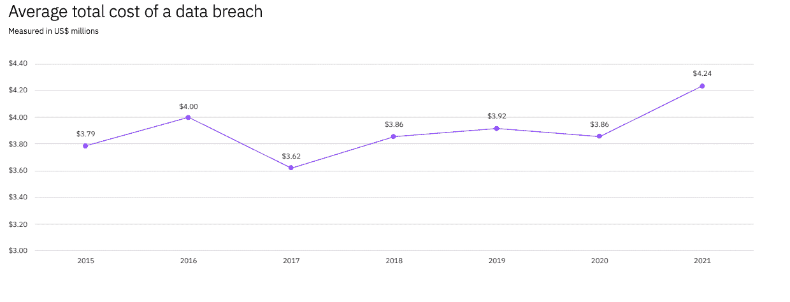
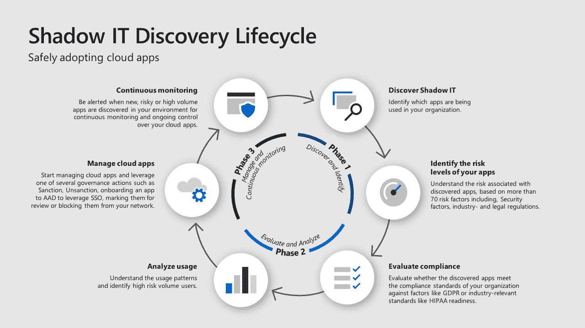

# 影子是什么？-章鱼部署

> 原文：<https://octopus.com/blog/what-is-shadow-it>

在传统组织中，IT 部门监督和管理所有 IT 资源。然而，由于可以如此轻松地访问基于云的 it 资源，缺乏耐心和时间的员工通常会发现，自己构建 IT 基础架构比填写请求和等待 IT 部门更简单、更快速。当员工创建和使用他们自己的 IT 资源，而这些资源对 IT 部门来说是不可见的，这就是所谓的影子 IT。

2017 年，Gartner 预测，IT 部门将做出更少的技术决策，单个业务部门将开始为其团队选择技术，占技术购买的[38%](https://www.gartner.com/smarterwithgartner/make-the-best-of-shadow-it)。2019 年，珠穆朗玛峰集团预测[组织中超过 50%的技术支出是由于影子 IT](https://www.everestgrp.com/2019-04-why-shadow-it-is-the-next-looming-cybersecurity-threat-in-the-news-49881.html/) 。云技术的兴起加剧了这一问题，使员工比以往任何时候都更容易使用未经批准的 it 资源。

影子 IT 给组织带来了新的问题。其中包括:

*   IT 部门应该如何应对影子 IT？
*   跟踪 100%的所有 it 资源现实吗，甚至实际吗？
*   是否应该有一个风险可接受的更可控的方法？
*   哪些工具可以帮助管理影子 IT？

这篇文章探讨了这些问题。

## 企业成本

越来越多的团队正在利用影子 IT，这增加了安全违规的风险，因为资源不在 IT 部门的控制范围内。

EMC 的一项研究估计，由于影子 IT 安全漏洞，数据丢失和停机每年会造成[1.7 万亿美元的损失。](https://corporate.delltechnologies.com/en-us/newsroom/announcements/2014/12/20141202-01.htm)

在 IBM 的 2021 年[数据泄露成本报告](https://www.ibm.com/au-en/security/data-breach)中，从 2020 年到 2021 年，数据泄露的平均成本从 386 万美元上升到 424 万美元。

 

来源:IBM

对于高度管制行业的企业来说，还存在合规性问题。[通用数据保护条例(GDPR)](https://gdpr.eu/tag/gdpr/) 对从欧盟(EU)人民处收集数据的组织实施了严格的规定。违法者将被处以高达数千万欧元的高额罚款。随着影子 IT 的增加，确保只有经过授权的员工才能访问敏感数据变得越来越困难。

影子 IT 也会影响运营成本。当影子 IT 不受管理时，服务变得分散，因为每个业务部门都根据自己的需求采购服务。一个业务部门可能偏好一种产品，而另一个则偏好其竞争对手。这也可能导致云基础架构不可预测的运营成本。想想所有为单一目的而创建的未受监控的虚拟机，它们总是在运行，但从未停止运行。通过允许业务部门采购自己的 IT 基础架构，企业失去了购买力优势和降低 IT 基础架构成本的能力。

影子 IT 的真实成本归结于不断增长的未知资源，这些资源存在运营和安全风险。

## 员工为什么要用影子 IT？

使用 shadow IT 的主要动机是方便。

IT 政策可能非常严格。通常，员工自己获得 it 解决方案比通过 IT 部门更容易、更快。员工也可能更喜欢特定的解决方案，而不是规定的解决方案，这加剧了问题。员工可能会找到问题的另一种解决方案，再次引入影子 IT，而不是处理支持票证。

不幸的是，使用影子 IT 解决方案的人通常不会意识到后果。他们只想以一种高效的方式完成工作。

自助服务操作手册可以通过确保简化的治理体验来解决这一问题，使员工能够在不避开 IT 部门的情况下提升他们所需的基础架构。

## 风险缓解

影子 IT 的未知性质增加了组织的风险状况。影子 IT 正在广泛传播和增长，所以这是一个管理风险的问题。Gartner 建议了三种[风险缓解策略](https://www.gartner.com/smarterwithgartner/make-the-best-of-shadow-it)来解决这一问题:

影子 IT 需要治理、发现和保护。解决方案必须精简，并最大限度地减少支持时间。

## 影子 IT 发现生命周期

这张图片来自[微软的博客文章](https://www.microsoft.com/security/blog/2019/03/26/step-7-discover-shadow-it-and-take-control-of-your-cloud-apps-top-10-actions-to-secure-your-environment/)，展示了影子 IT 发现生命周期的各个阶段。这支持了任何影子 IT 的解决方案都应该有治理和法规遵从性。

T3T5

来源:微软

在维护治理的同时减少合规障碍是管理影子 IT 的重要一步。Octopus Deploy 的 [Runbooks 特性](https://octopus.com/docs/runbooks)有助于实现整个组织的合规性和治理。

## 什么是 runbook？

runbook 是一种可重复使用的方法，用于执行经常重复的任务。runbooks 可以自动执行的任务类型包括最大限度地减少应用停机时间、简化日常维护以及提供自助操作。让我们看一下操作团队可能收到的请求，刷新测试数据库中的数据。

通常，当开发人员需要刷新测试数据库中的数据时，需要执行以下操作:

1.  开发人员向支持团队创建一个请求来刷新他们数据库中的数据。
2.  支持团队审查请求以了解需求。
3.  如果支持团队需要额外的信息，他们会向开发人员请求。
4.  当支持团队拥有了处理请求所需的一切时，他们就可以运行刷新数据库中数据的过程。

根据支持团队的工作量和周转时间，这个请求可能需要几分钟到几天的时间，并且开发人员通常不知道时间表。操作手册有助于避免这些陷阱。

刷新数据库中数据的步骤可以由 runbook 捕获并执行。runbook 还包括执行任务的所有权限，这意味着 run book 可以自助服务。这允许用户执行任务，而无需请求和等待支持团队成员。

任何可以自动化的任务都可以记录在操作手册中，允许团队成员完成以前需要专门团队完成的任务。

运行手册也引入了一致性。想象一下创建新 AWS 帐户的自助操作手册。用户需要设置访问级别、VPC 设置和其他 IAM 注意事项。如果 50 个不同的用户试图建立一个帐户，这可能导致 50 个不同类型的用户，这是另一个挑战。如果您将此应用于创建虚拟机、容器注册中心或其他 PaaS 基础设施，很容易发现 shadow IT 的问题。

使用操作手册可以限制这一过程，并使 IT 资源标准化。运营团队可以使用操作手册来监控和保护 IT 资源。

虽然 run book 不能解决影子 IT 的所有障碍，但 run book 可以改善 IT 资源管理并简化最终用户的使用。[根据 MRC 关于管理影子 IT 风险的规定](https://www.mrc-productivity.com/blog/2016/07/6-ways-to-reduce-shadow-it-security-risks/):

> 这一步的目标是受控的自助式解决方案。您提供的任何软件都必须满足两个重要标准:
> 
> *   自助服务:用户必须在不打扰解决方案的情况下使用它。
> *   控制:它必须仍然能够控制数据和用户访问。
> 
> 当您提供受控的自助服务选项时，您的企业将两全其美。用户可以快速获得他们需要的解决方案，而 IT 仍然可以保护数据和应用程序。"

操作手册让运营团队监控资源并提供安全保障。他们还允许员工在没有支持的情况下自助解决问题。

## 结论

影子 IT 是指不在组织控制范围内的任何 IT 资源。它给企业带来了多种风险和高成本的问题。

企业需要对 IT 资产进行更多的治理、发现和保护。员工希望流程更加简化，并且能够在没有太多支持的情况下解决问题。

Runbooks 可以通过提供运行常见任务的自助方式来解决这些问题。将这一概念应用于像设置云帐户这样的问题，为 IT 资产提供了标准化。

阅读我们的 [Runbooks 系列](https://octopus.com/blog/tag/Runbooks%20Series)的其余部分。

愉快的部署！