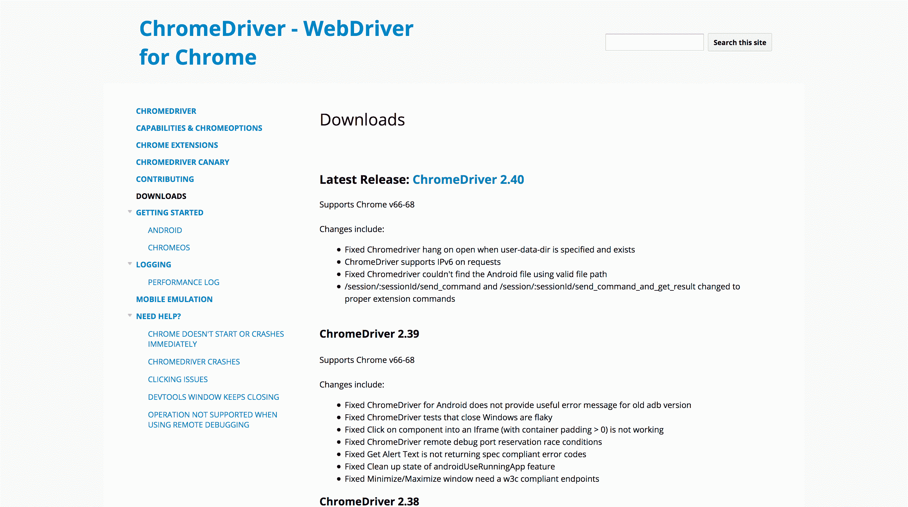
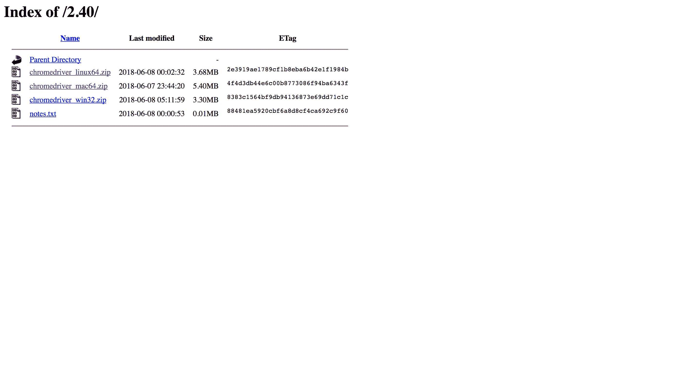
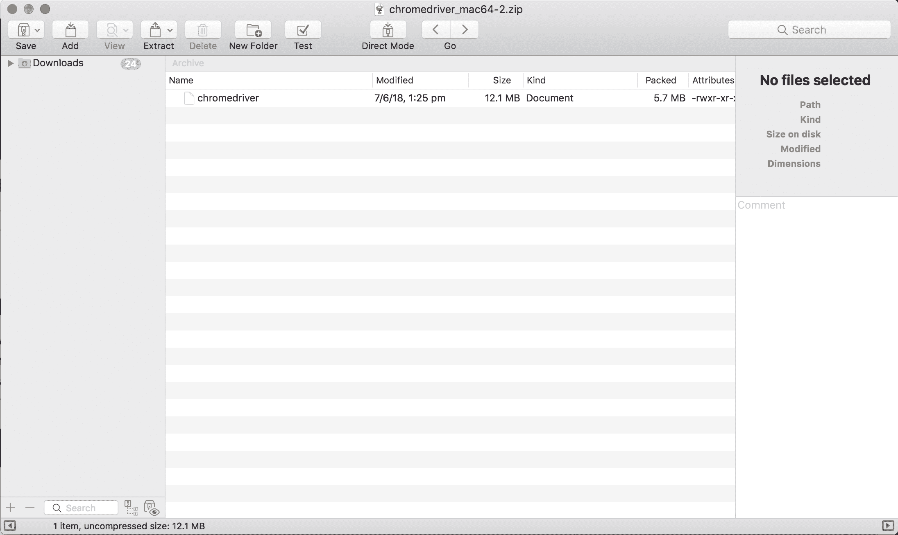
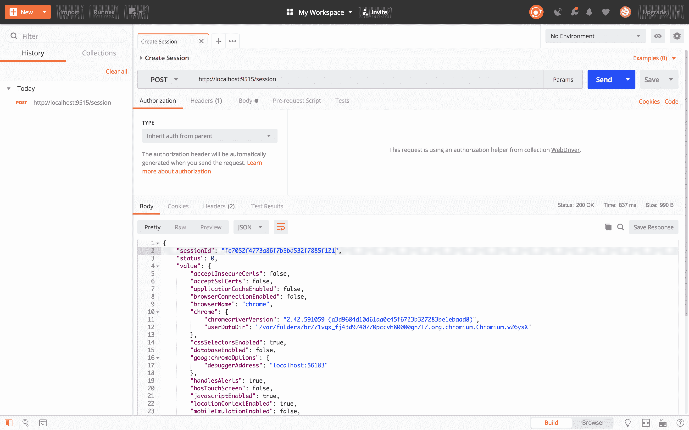
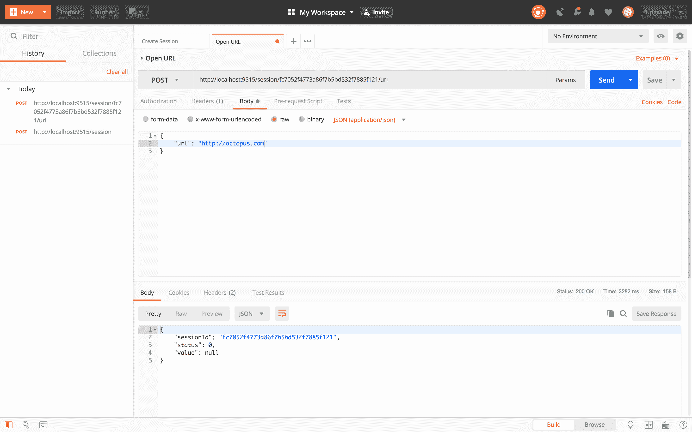
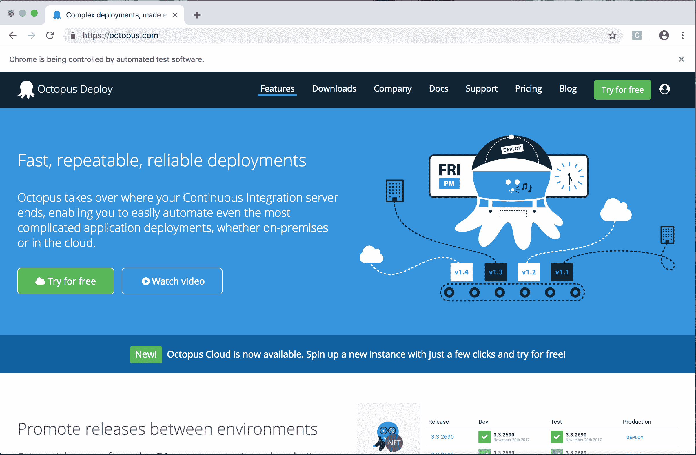
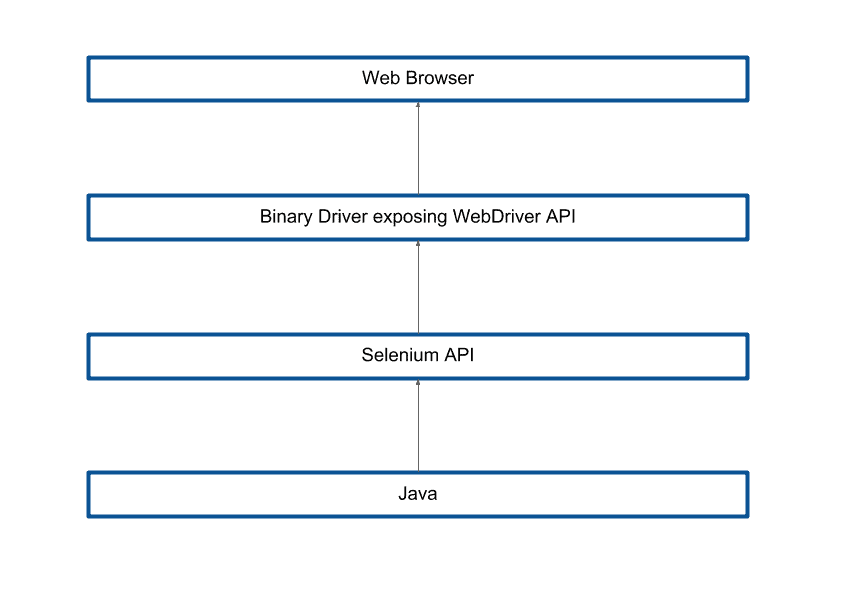

# Selenium 系列:什么是 WebDriver 和 Selenium？-章鱼部署

> 原文：<https://octopus.com/blog/selenium/1-what-is-webdriver-and-selenium/what-is-webdriver-and-selenium>

这篇文章是关于[创建 Selenium WebDriver 测试框架](/blog/selenium/0-toc/webdriver-toc)的系列文章的一部分。

谈到测试 web 应用程序，您可能听说过 WebDriver 和 Selenium。这两个术语通常可以互换使用，甚至可以组合使用，以指代开发人员可以编写代码与 web 浏览器进行交互的平台。然而，这两个术语所指的东西略有不同。

从技术上讲，WebDriver 是一个标准的、基于 HTTP 的 API，用于与 web 浏览器交互。该标准由 W3C 在 https://www.w3.org/TR/webdriver1/提供，任何人都可以免费实现。

大多数浏览器供应商通过浏览器本身附带的附加可执行文件来实现 WebDriver API。下面的列表显示了主要浏览器在哪里提供这个二进制驱动程序:

为了查看 WebDriver API 的运行情况，我们将下载并运行 Chrome 二进制驱动程序。打开[https://sites . Google . com/a/chromium . org/chrome driver/downloads](https://sites.google.com/a/chromium.org/chromedriver/downloads)，点击最新发布的链接。

[](#)

然后为您的本地操作系统下载驱动程序。

[](#)

我用的是 Mac，所以我下载了`chromedriver_mac64.zip`。在这个归档文件中是名为`chromedriver`的驱动程序可执行文件。Windows 版本叫做`chromedriver.exe`。

[](#)

提取这个文件并运行它。您将获得公开 WebDriver API 的端口:

```
$ ./chromedriver

Starting ChromeDriver 2.40.565386
(45a059dc425e08165f9a10324bd1380cc13ca363) on port 9515

Only local connections are allowed. 
```

为了与 API 交互，我们需要一个允许我们发出 HTTP 请求的工具。我用过 Postman，它可以从[https://www.getpostman.com/](https://www.getpostman.com/)买到。

第一步是打开浏览器。这是通过创建新会话来完成的。

为了通过 WebDriver API 创建一个新的会话，我们向`/session`端点发出一个 HTTP POST 请求。此外，我们需要定义我们希望打开的浏览器的类型。该信息在 POST 主体中的 JSON 对象中发送。在本例中，我们将打开 Chrome:

```
{
    "desiredCapabilities": {
        "browserName": "chrome"
    }
} 
```

这个请求的响应包括一个`sessionId`。我们可以用它在刚刚打开的浏览器窗口上执行额外的操作。

[](#)

下一个逻辑步骤是在浏览器中打开一个 URL。这是通过对`/session/<session id>/url`的 HTTP POST 请求来完成的，POST 主体包括将要打开的 URL:

```
{
    "url": "http://octopus.com"
} 
```

[](#)

该调用导致在浏览器中打开所请求的 URL。

[](#)

此时，你可能会感到有些不知所措。像 Postman 这样的工具使用 JSON body 对 REST API 进行 HTTP 调用……这是一个非常复杂的过程，打开一个浏览器并浏览到一个 URL 的过程并不简单。

但是不用担心。作为开发人员，我们从来不需要直接使用 WebDriver API，事实上这将是我们在这个博客系列中第一次也是最后一次直接查看 WebDriver API。

从这一点开始，我们编写的所有代码都将使用 Selenium API。Selenium 是由第三方提供的一个库，它包装了与浏览器交互时需要进行的所有 WebDriver API HTTP 调用。通过 Java 类和接口公开 WebDriver API 的功能，Selenium API 使得编写与浏览器交互的 Java 应用程序变得更加容易。

下图显示了浏览器、二进制驱动程序、Selenium API 和我们将要编写的 Java 代码之间的关系。

[](#)

Selenium 与 WebDriver 同义，因为它是利用 WebDriver API 的最流行的方式。我个人从未在现实世界中见过直接针对 WebDriver API 编写代码的案例。因此，术语 WebDriver、Selenium 和 Selenium WebDriver 可以互换使用，指的是 Selenium API，而不是较低级别的 WebDriver API。

这篇博客的关键是:

*   WebDriver API 是一个基于开放标准的低级 HTTP 接口。
*   Selenium API 是调用 WebDriver API 的类和接口的集合。
*   因为直接使用 WebDriver API 不切实际，所以大家都用 Selenium API。
*   术语 WebDriver、Selenium 和 Selenium WebDriver 可以互换使用，通常指 Selenium API。

既然我们已经知道了 WebDriver 和 Selenium APIs 之间的区别，那么实际上我们可以将它们视为同一个东西。在讨论如何编写 WebDriver 测试时，我们从现在开始编写的所有代码都将使用 Selenium API。因此，尽管你现在知道 WebDriver 和 Selenium APIs 在技术上不是*T4 的同一个东西，我们通常称“Selenium WebDriver”为我们与浏览器交互的平台。*

这篇文章是关于[创建 Selenium WebDriver 测试框架](/blog/selenium/0-toc/webdriver-toc)的系列文章的一部分。