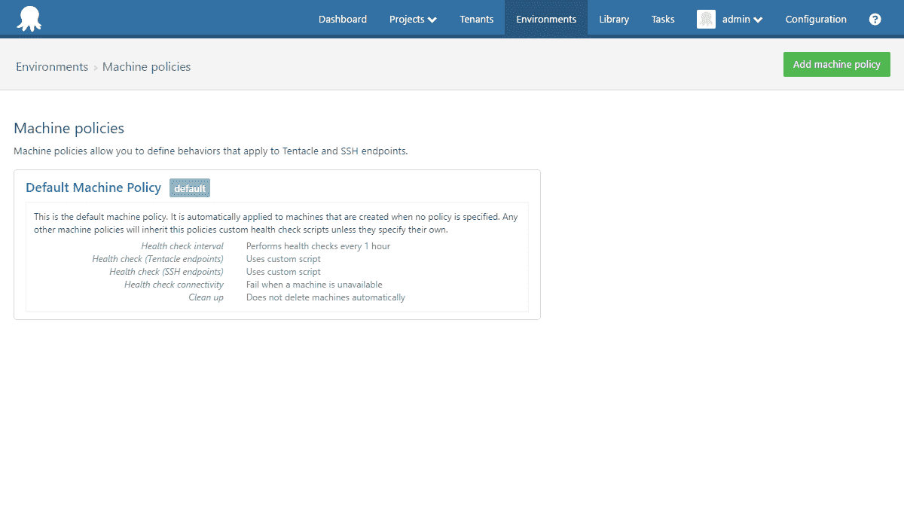
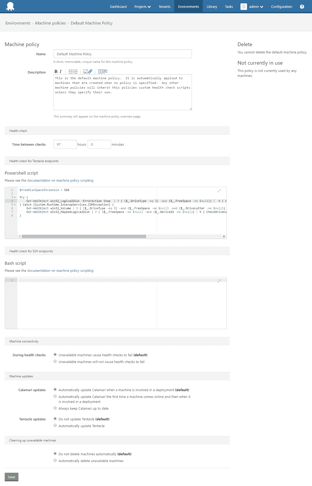
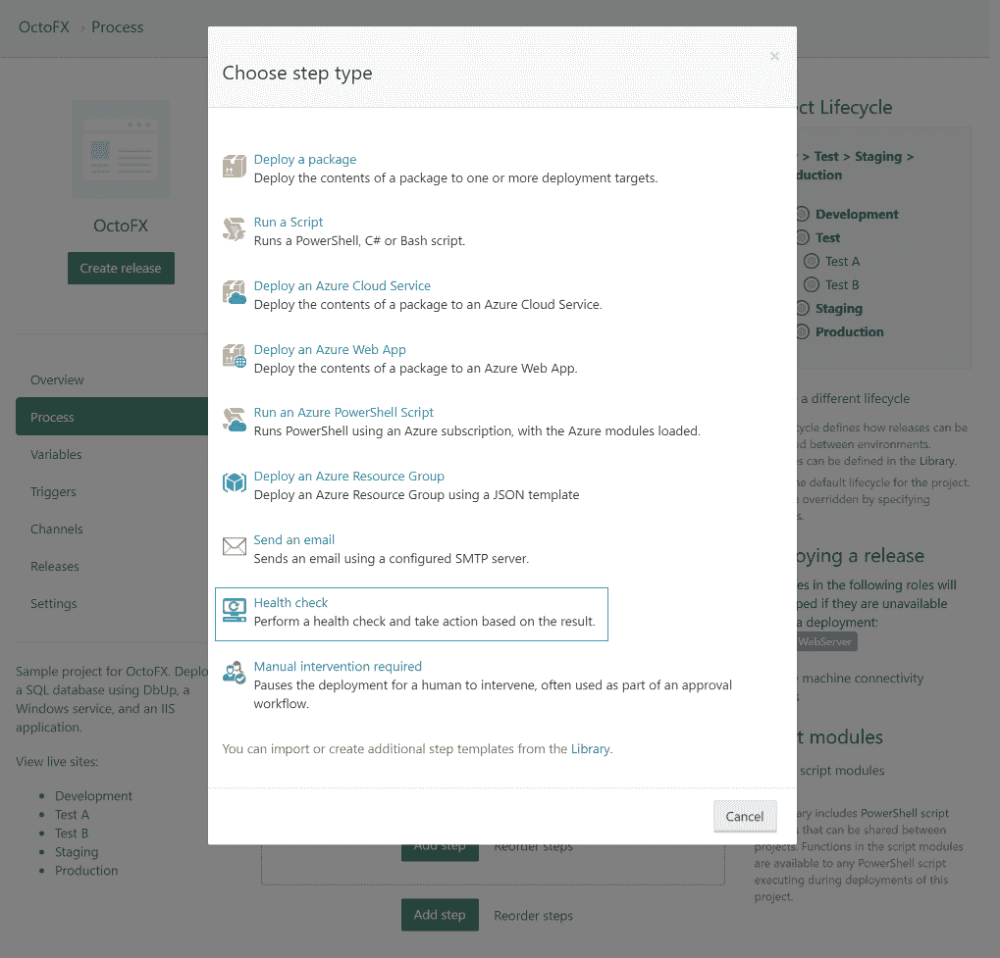
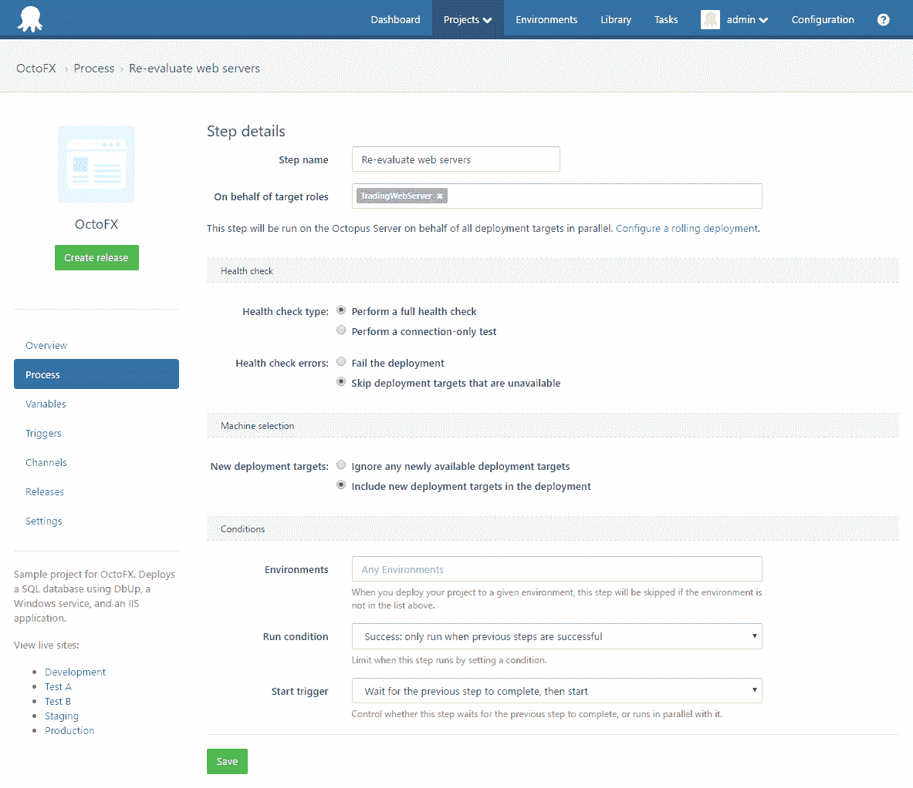
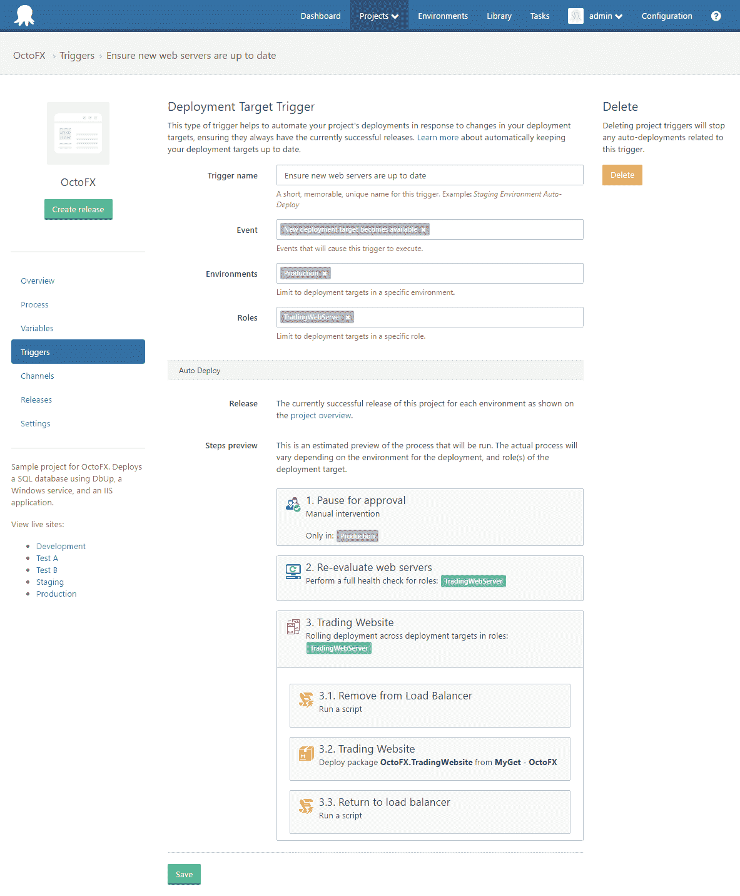
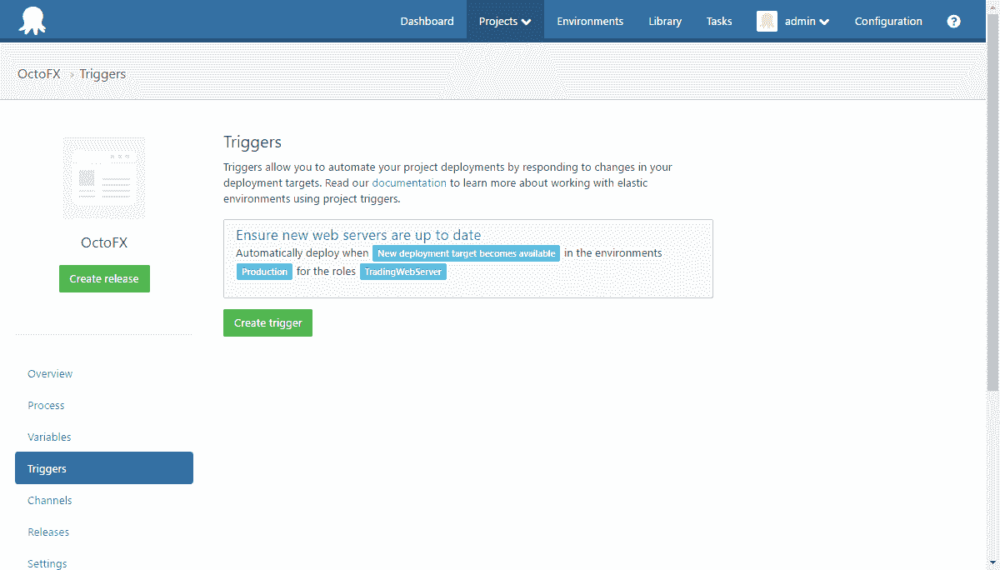
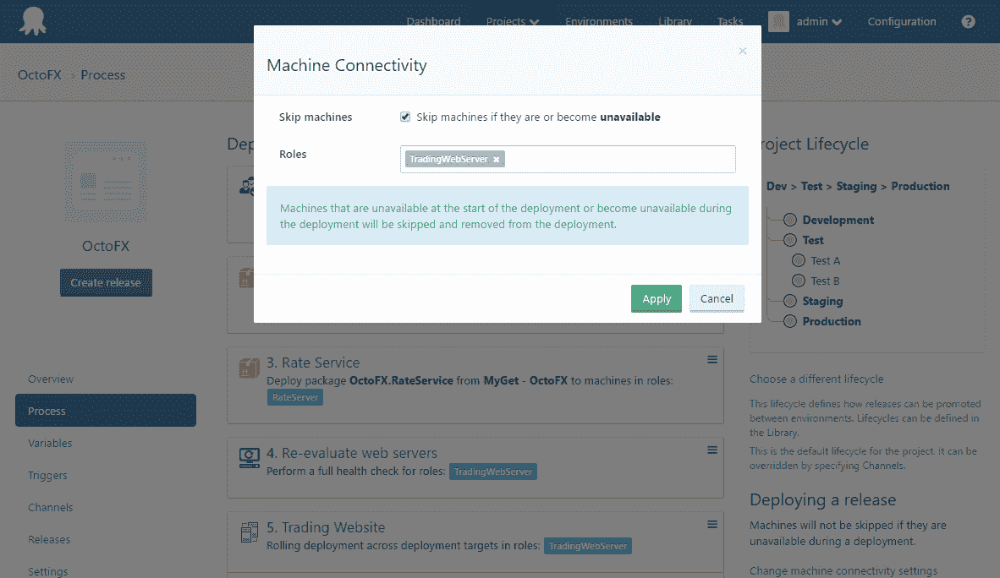

# Octopus 3.4 的新特性:弹性和瞬态环境——Octopus 部署

> 原文：<https://octopus.com/blog/whats-new-elastic-transient-environments>

这篇文章是我们 Octopus 3.4 博客系列的一部分。在我们的[博客](https://octopus.com/blog/octopus34-blog-series-kickoff)或我们的[推特](https://twitter.com/OctopusDeploy)上关注它。

**Octopus Deploy 3.4 已经发货！阅读[博文](https://octopus.com/blog/octopus-deploy-3.4)和[今天就下载](https://octopus.com/downloads)！**

* * *

## Octopus 3.4 的新特性:弹性和瞬态环境

我想从我们的深入探讨和幕后帖子中退一步，给出弹性和瞬态环境特性集的概述。弹性和瞬态环境引入了一系列新特性，这些新特性使得能够更好地支持在机器可以来来去去的环境中工作。

## 特征

### 机器政策

机器策略是一组与机器相关的设置，使您能够定制运行状况检查执行的内容(以及执行的频率)，控制触手和 Calamari 更新，以及当机器不可用时会发生什么。这些功能极大地改善了您在机器来来去去的环境中的工作方式。机器策略针对每台机器进行设置，并可在*环境*屏幕中进行配置。

机器策略允许您:

*   定义健康检查的时间间隔
*   定义运行状况检查期间在触手上运行的额外脚本
*   定义运行状况检查期间离线计算机的行为
*   定义乌贼和触手何时更新
*   定义发现离线时是否清理机器

### 健康检查步骤

基于机器策略，我们还引入了运行状况检查步骤，使您能够触发运行状况检查，作为项目部署过程的一部分。这在定期添加或删除机器以及长期运行部署的环境中很有价值。是的，这意味着在 a 部署期间，您可以重新评估机器是否在线*！*

### 项目触发器

触发器是一个很棒的新功能，它可以确保添加到环境中的新机器保持最新的适当版本。它们在响应事件时执行，并根据项目进行指定。它允许您创建一个触发器，以便在特定环境中为某些角色提供新的部署目标时自动进行部署。可以通过选择项目屏幕上的触发器菜单项来找到触发器。

### 项目机器连接设置

通过与其他新功能配合使用，project machine connectivity settings 允许您指定在部署期间计算机不可用时会发生什么情况。这有助于避免在部署时临时计算机不可用时部署失败。这意味着您不必单独选择在线机器作为部署目标！相反，我们将自动跳过离线机器。

## 包裹

我希望您喜欢探索构成弹性和瞬态环境的高度要求的特性。更多信息，请参见[弹性和瞬态环境指南](http://docs.octopusdeploy.com/display/OD/Elastic+and+Transient+Environments)。