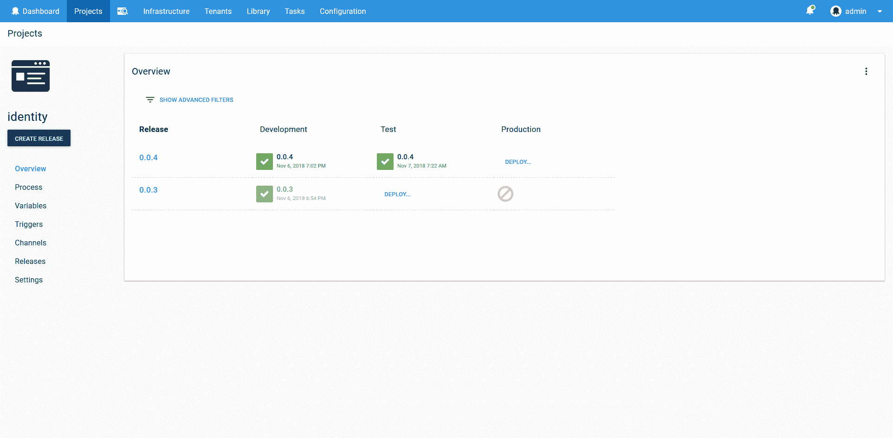
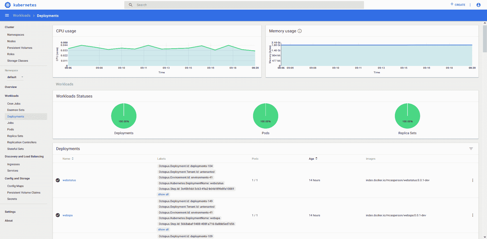
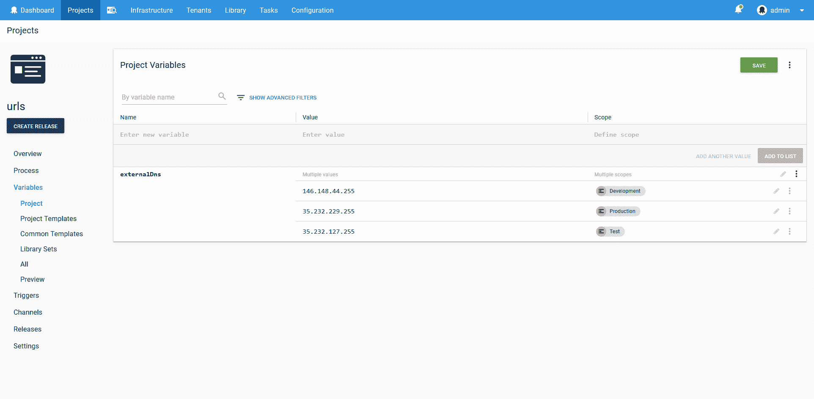
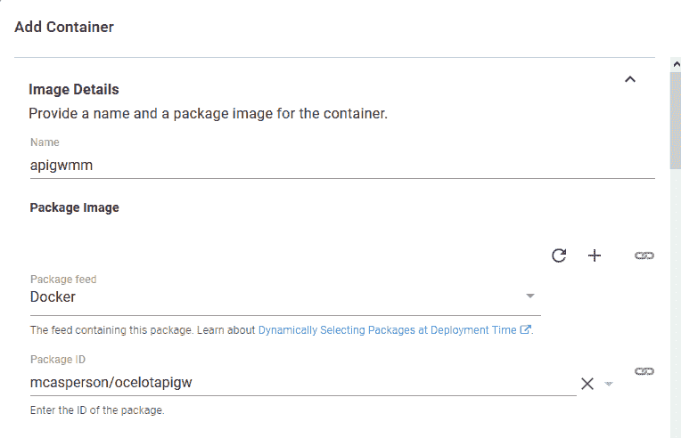
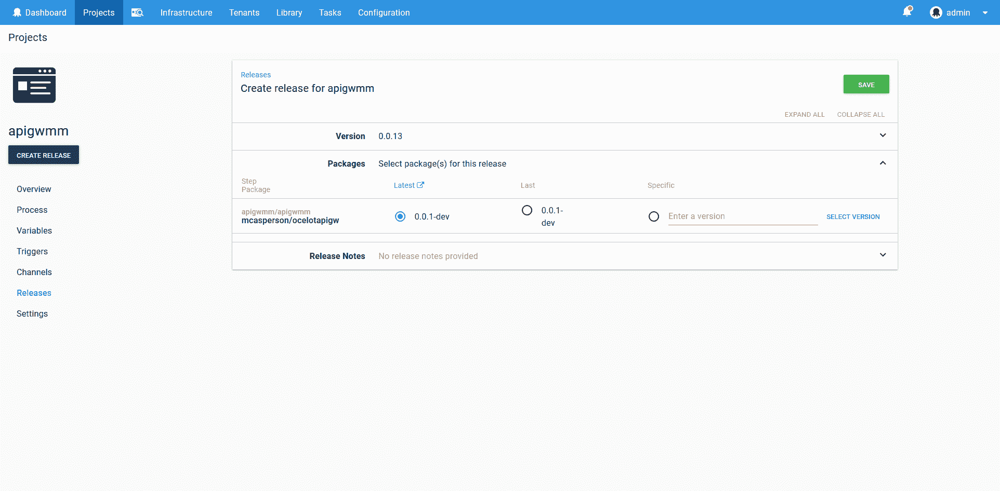
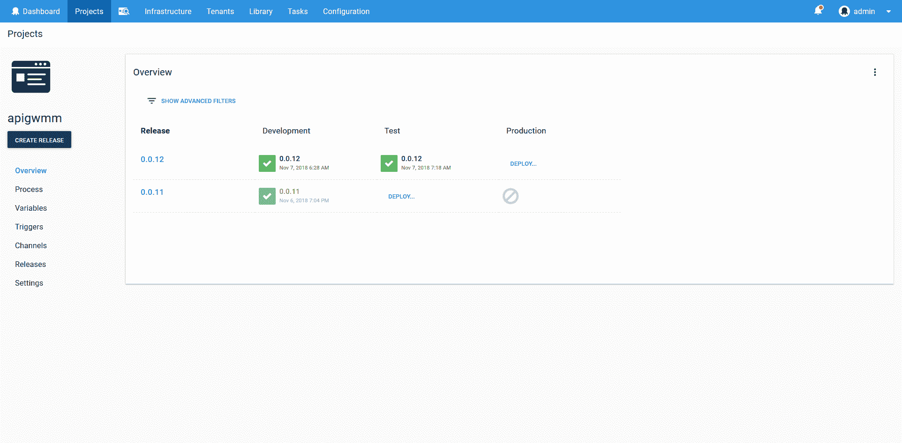
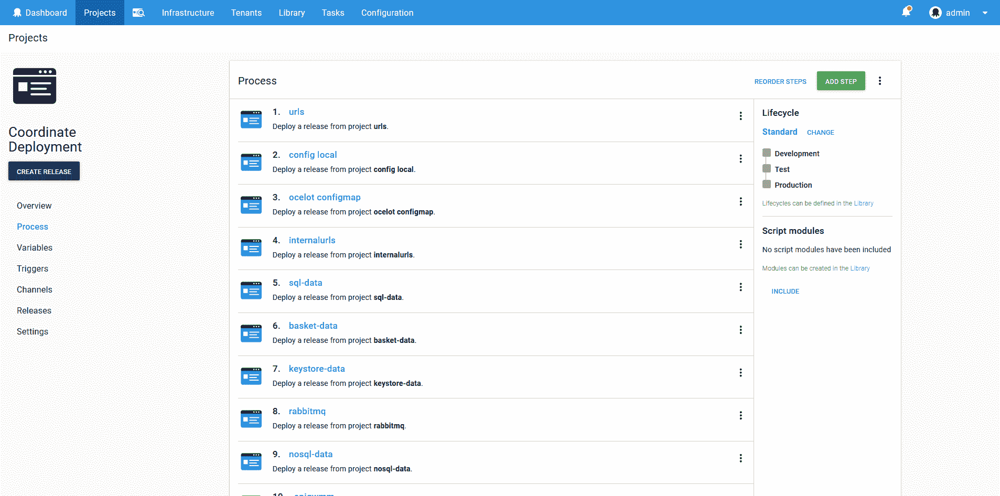
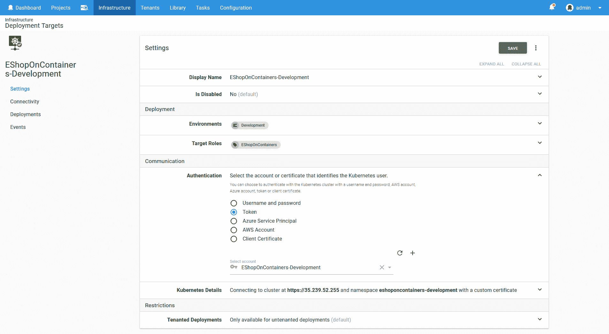
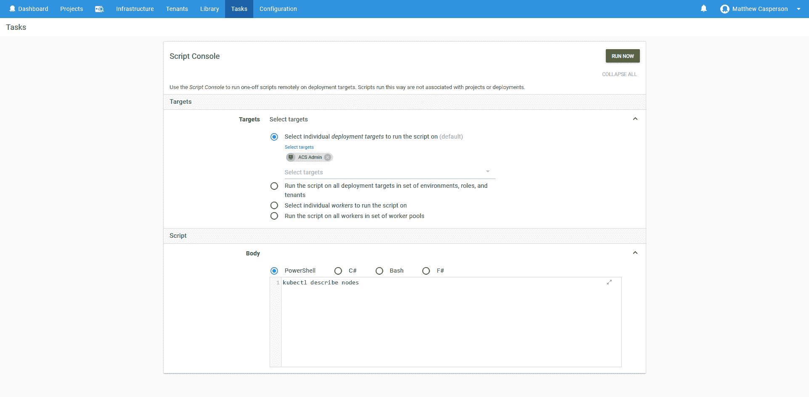
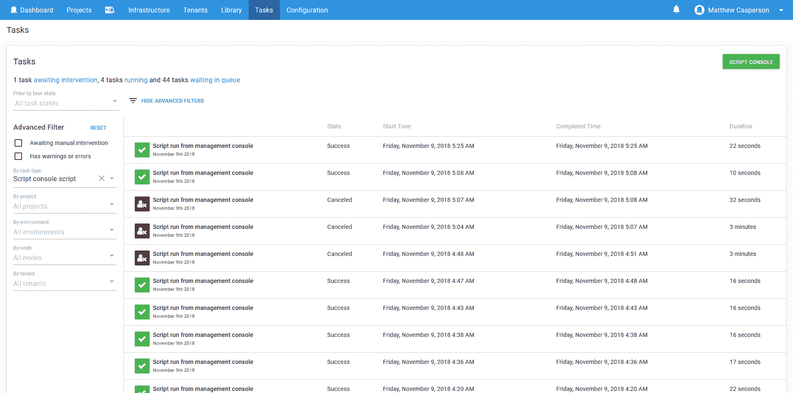

# 为什么在 Kubernetes 部署中使用 Octopus？-章鱼部署

> 原文：<https://octopus.com/blog/why-kubernetes-and-octopus-deploy>

回到 Octopus 2018.9，我们引入了一系列功能，为 Octopus 中的 Kubernetes 提供了核心支持。

在本文中，我将介绍使用 Octopus 管理 Kubernetes 部署的一些好处。毕竟，Kubernetes 已经为它的所有资源提供了一个丰富的声明性模型，一个全功能的命令行工具，以及更多的仪表盘。

Octopus 2021 Q3 包括对 Kubernetes 部署的更新支持，以及针对 Google Cloud、AWS 和 Azure 用户的 runbooks。在我们的[发布公告](https://octopus.com/blog/octopus-release-2021-q3)中了解更多信息。

## 建模您的开发环境

开发团队中的一个常见做法是在不同的环境中开发代码。虽然没有两个团队是相同的，但是我曾经合作过的每个团队都采用了一些 **开发➜测试➜生产** 环境生命周期的变体。

环境进展是 Octopus 的核心概念，这并非巧合。环境是 Octopus 中的核心实体，产品的每个部分都包含了对生产环境部署的管理。

从生命周期到频道再到仪表盘，Octopus 使你的团队如何工作的建模变得容易，并以一种可靠和可见的方式促进发布。

以一个 Octopus 项目的概述为例。该表清楚地显示了在什么时间向什么环境发布了什么版本。只需点击几下鼠标，您就可以获得更详细的信息，例如谁执行了部署以及包含了哪些版本的包。

另一方面，Kubernetes 仪表板关注于显示关于 Kubernetes 资源的信息，比如 pod、服务和部署。这是集群的低级视图，可用于调试和监控。

Octopus 允许您对您的团队已经在使用的环境进行建模，而 Kubernetes 仪表板为调试和其他管理任务提供了一个低级别的资源视图。结合 Octopus 和 Kubernetes，您可以从上到下查看您的基础设施。

## 管理应用程序变量

Helm 提供了一种表达性模板语言，允许从多个来源提供变量，包括变量 YAML 文件或命令行。这个功能允许定义复杂的和可定制的部署，使得 Helm 成为事实上的 Kubernetes 包管理器。

但是模板语言只是故事的一半。另一半是管理定义特定部署的变量。

Octopus 提供了一个具有全面变量管理功能的解决方案，包括秘密存储和范围规则。这些变量可以传递到 Helm 中，在 Kubernetes 步骤中使用，或者在自定义步骤中使用。

通过利用 Octopus 管理变量，复杂的 Helm 和 Kubernetes 部署可以轻松地跨多个环境和集群进行协调。

## 版本化您的 Docker 容器

部署流程创建后，通常不会有太大变化。不同部署之间会发生变化的是容器版本。

Octopus 将构建部署的设计时过程与选择包版本的部署时过程分开。这意味着当您推出容器的新版本时，Octopus 会在部署期间选择这些版本，并将它们合并到生成的 YAML 文件中。

正如您在下面的截图中看到的，在设计 Kubernetes 部署时，您指定了容器 ID，但没有指定版本。

然后在部署过程中，您可以选择一个特定的容器版本，或者简单地让 Octopus 为您选择最新的版本。

Octopus 通过分离设计和部署时间问题，使管理可重复部署变得容易，这意味着您只需要在推出新部署时担心您希望部署哪个版本的容器。

## 单独迭代或集体进步

微服务是一种越来越受欢迎的开发策略，它允许专注的团队在更大的生态系统中快速交付小的变化。

然而，将一组已知版本的单个微服务升级到下一个环境并不是不常见的需求。虽然微服务架构不鼓励这种依赖性，但公司测试或外部法规可能要求您的环境在任何时间点都处于众所周知的状态。

Octopus 可以对这些开发策略进行建模，无论你的团队是通过环境独立推广单个微服务，还是多组微服务一起推广。

对于独立推广自己个人微服务的团队，可以使用个人 Octopus 部署项目。

为了以可预测的顺序提升一组已知版本的微服务，项目可以使用[部署发布步骤](https://octopus.com/blog/deploy-release-step/deploy-release-step)。通过将其他项目的部署视为可部署的资源，**部署发布**步骤允许团队在给定的时间点捕获环境的状态，并将该状态部署到下一个环境。

在下面的截图中，你可以看到一个 Octopus 项目的例子，其中包括一系列的**部署发布**步骤。这些步骤的顺序确保了微服务以固定的顺序部署，一组**部署发布**步骤代表了一个完整的微服务生态系统，它作为一个单元部署到新环境中。

使用 Octopus 来管理 Kubernetes 部署可以让您在开发过程中自由地快速迭代，同时以可预测的方式在环境之间进行升级。

## 管理云和从内部迁移

Kubernetes 是您工具箱中的一个优秀工具，但它不太可能是您将使用的唯一工具。Kubernetes 真的是托管静态文件的最佳选择，还是 S3 或 Azure 存储更合适？您还需要使用本地数据库吗？RDS 是不是比容器化数据库更好的选择？

增量迁移、遗留系统和强大的 PaaS 产品通常意味着您的部署策略不会局限于您的 Kubernetes 集群。因为 Octopus 已经支持广泛的云和本地平台，所以您可以跨 Kubernetes 和现有服务无缝集成部署流程。

如果您的部署确实跨越多个技术堆栈，您可以放心，上述所有优势同样适用于您的内部部署和云部署，以创建一个统一的部署流程。

## 使用最佳实践对 Kubernetes 部署进行建模

互联网安全中心就如何保护您的 Kubernetes 基础设施提供指导。特别是，有两个建议与您的部署策略特别相关:

*   1.6.1 确保仅在需要时使用群集管理角色。
*   1.6.2 使用名称空间在资源之间创建管理边界。

Octopus 鼓励通过目标使用具有有限权限的凭证部署到单独的名称空间。Octopus 中的 Kubernetes 目标捕获集群 URL、帐户和名称空间，并且作用于角色和环境。

通常，Kubernetes 目标对于每个环境和角色都有一个惟一的名称空间。建议关联帐户仅拥有在该命名空间内部署所需的权限。结果是 Kubernetes 目标代表了集群中的权限边界。遵循这种模式可以确保您的部署不依赖于单个管理员帐户，并在名称空间内隔离资源。

【T2 

通过使用目标，Octopus 鼓励您以安全和可管理的方式对 Kubernetes 部署建模。

## 集中式审计 Kubernetes 集群管理

你曾经通过电子邮件或 Slack 发送过配置文件吗？您是否曾被要求报告一次生产中断，但却不知道发生了什么变化，因为从人们的桌面上进行了未记录的修改？

不幸的是，这些情况非常普遍。随着您的 Kubernetes 集群变得越来越复杂，管理凭证和了解变化的影响会变得越来越困难。

Octopus 通过**脚本控制台**提供解决方案。通过使用**脚本控制台**，开发人员和管理员可以与 Kubernetes 集群进行交互，而无需共享凭证。可以对一个或多个 Kubernetes 目标运行特殊命令，运行的命令、运行它的人以及结果都保存在审计日志中，以后可以查看。

通过**脚本控制台**，Octopus 让团队能够调试和管理他们的 Kubernetes 集群，而不需要分发凭证，并且有一个审计日志来记录每个更改。

## 结论

Octopus 在交付可重复且可靠的部署方面有着悠久的历史，并且已经发展到支持数千个开发团队中的部署模式。

通过使用 Octopus 来管理您的 Kubernetes 部署，您可以获得快速成为管理高密度基础架构的标准平台的所有好处，并将经过实战检验的部署策略融入 Octopus 中。

愉快的部署！