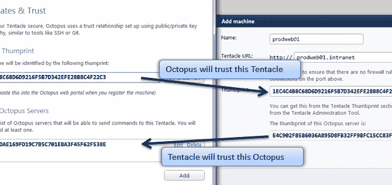
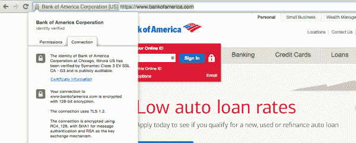

# 为什么八达通使用自签名证书-八达通部署

> 原文：<https://octopus.com/blog/why-self-signed-certificates>

Octopus Deploy 服务器和 Tentacles 之间的通信使用 X.509 证书进行保护。安装 Octopus 后，会生成一个新的自签名证书。安装 Tentacles 时，它们还会生成一个新的自签名证书。在这篇文章中，我想讨论一下为什么我们使用自签名证书——毕竟，这不是很糟糕吗？

## 背景

当触手在 Octopus 中注册时，拇指纹(标识证书的公钥)被交换——也就是说，您手动将 Octopus 拇指纹粘贴到触手设置向导中，并在 Octopus UI 中手动验证触手的拇指纹。这张截图来自 Octopus 1.0，但在 2.6 中也有相同的概念:

当 Octopus 连接到触手时，它会验证触手是否提供了带有它所期望的指纹的证书。同样，当触手处理一个连接时，它会验证这个连接是否来自它信任的 Octopus 服务器。如果对方不是他们认为的那个人，双方都会中止连接。

## 为什么自签名？

有时会出现一个关于我们为什么使用自签名证书的问题——这难道不是一种糟糕的做法吗？要回答这个问题，让我们反过来问:为什么要使用证书颁发机构？

假设你想做一些网上银行。你去你的银行网站，并被重定向到他们的 HTTPS 网站。

你实际上不知道这是不是美国银行。但是你的浏览器信任赛门铁克(拥有 VeriSign)，赛门铁克告诉你“当有人为 BankOfAmerica.com 订购证书时，我们给他们打了电话并做了一些其他检查，我们非常确定这确实是美国银行。你信任我们，因为我们是诺顿，对吗？”

这里有一个更安全的替代方案，可以替代依赖赛门铁克这样的证书颁发机构(CA ):当你在银行分支机构设立账户，与银行经理握手时，他们会给你一个指纹，作为他们网站证书的指纹。你把它写在一些纸上，当你回家时，你把它插在你的电脑上。这样你就不需要任何认证机构:你的计算机将只信任 BankOfAmerica.com，而不需要任何第三方。

为了方便起见，我们有认证机构，因为期望人们为他们计划访问的每个站点写下公钥太费力了。我们没有安全认证机构:它们实际上降低了安全性。CA 受到威胁:还记得 [DigiNotar](http://en.wikipedia.org/wiki/DigiNotar) 吗？

## 如果章鱼用了 CA 的

如果 CA 和 Octopus 一起使用，我们有两种方法可以使用它们:

1.  我们只信任由 CA 发布的任何内容。我们没有检查章鱼/触手是否可信，而是假设如果它们提供了由你的公司颁发的证书，那么就可以进行通信了。
2.  无论如何，我们都要验证指纹，并用它们来建立信任。

方法#1 是危险的，因为如果 CA 受到威胁，那么网络上的每台机器实际上都受到威胁，因为任何拥有有效证书的人都可以伪装成其他人。无论 CA 是您组织内部的，还是受信任的第三方，这一点都适用。使用我们当前的方法，由于我们单独验证证书，机器 A 不可能在没有机器 B 的私钥的情况下伪装成机器 B。

方法#2 更好，只是我们实际上忽略了 CA。如果我们自己验证指纹，CA 在这种情况下提供了什么价值？

有人可能会说，Octopus 应该支持使用 CA 来颁发证书，只是因为“感觉良好”的因素，因为我们已经习惯于认为自签名证书在某种程度上本质上是不好的。你可以使用`Tentacle.exe import-certificate`让 Tentacles 使用 CA 颁发的证书(但是目前在 Octopus 服务器上没有办法做到这一点)，但是我认为争论是由公司政策驱动的(“禁止自签名证书！”)而不是通过合理的推理。

从安全的角度来看，我们能想到的关于 CA 在 Octopus 中有意义的唯一理由是撤销列表。但是你总是可以告诉 Octopus/触手不再信任一个给定的证书，而不需要 CRL，所以我认为这个论点也站不住脚。

我们在 Octopus 中非常重视安全性，我们也尽力使其易于使用。我们认为从安全的角度来看，交换指纹和使用自签名证书是最好的解决方案，添加任何额外的 CA 支持层似乎会使软件变得比必要的更复杂，并且要么没有增加任何价值，要么根据其实现方式来创建攻击媒介。我希望这篇文章能对我们的推理有所启发。

*感谢 [OJ](https://twitter.com/thecolonial) 来自 [Beyond Binary](https://twitter.com/beyondbase2) 对本帖*草稿的审阅