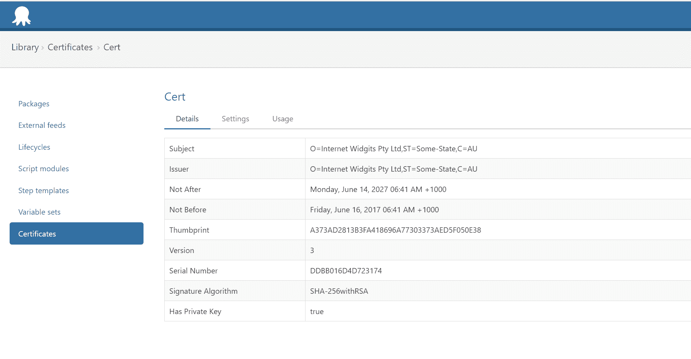
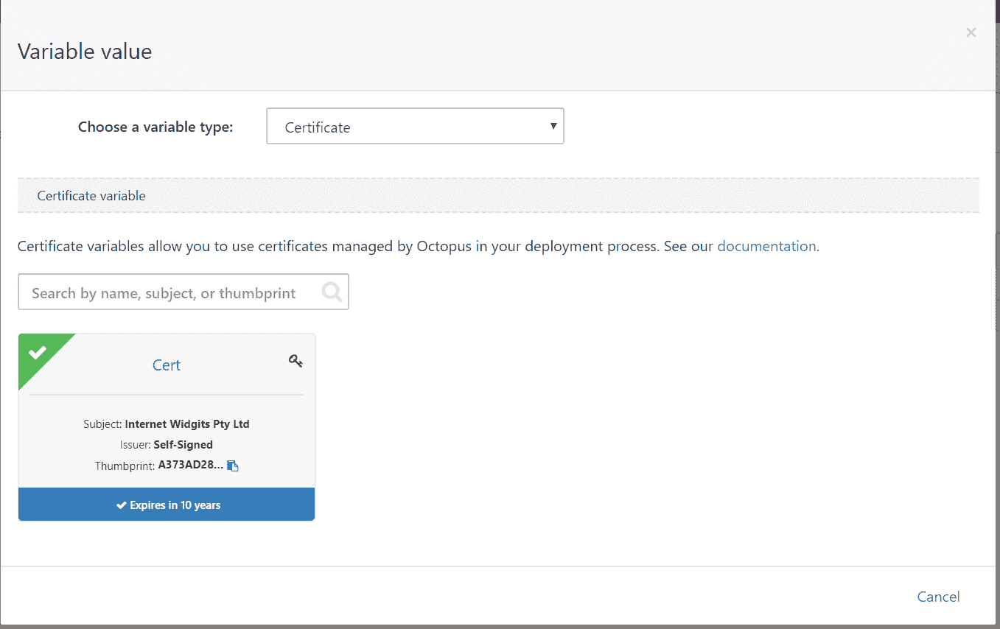
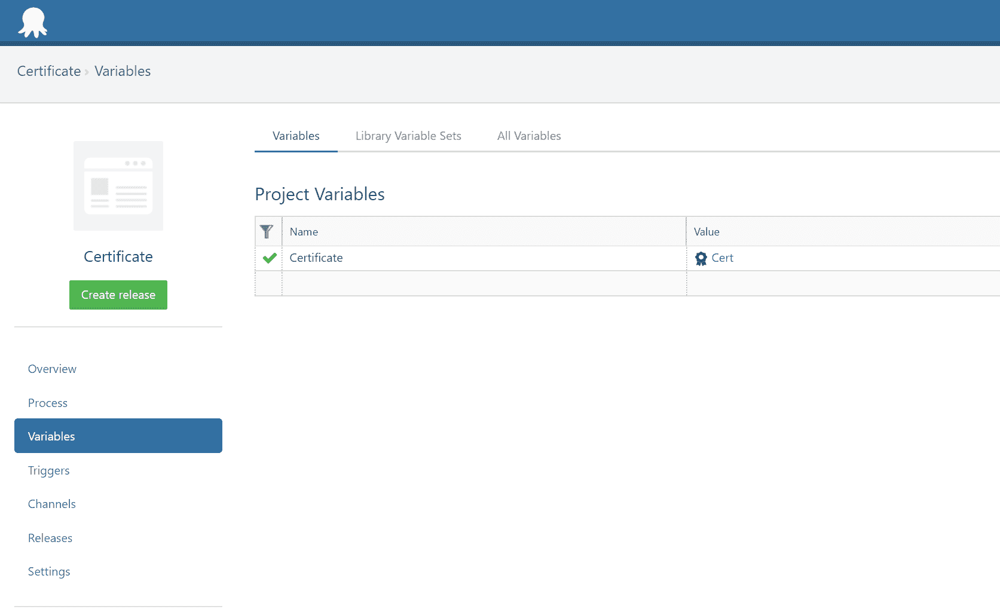
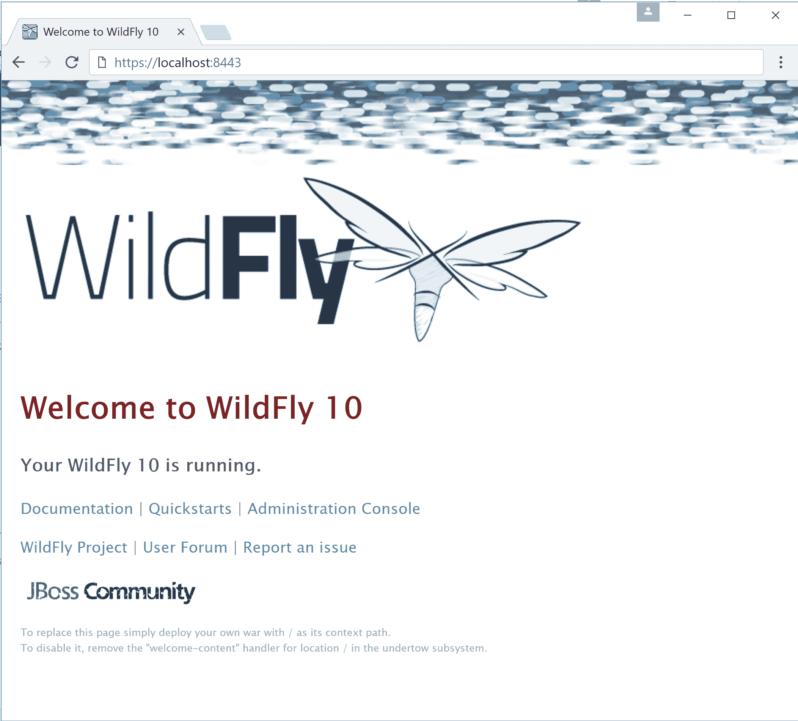
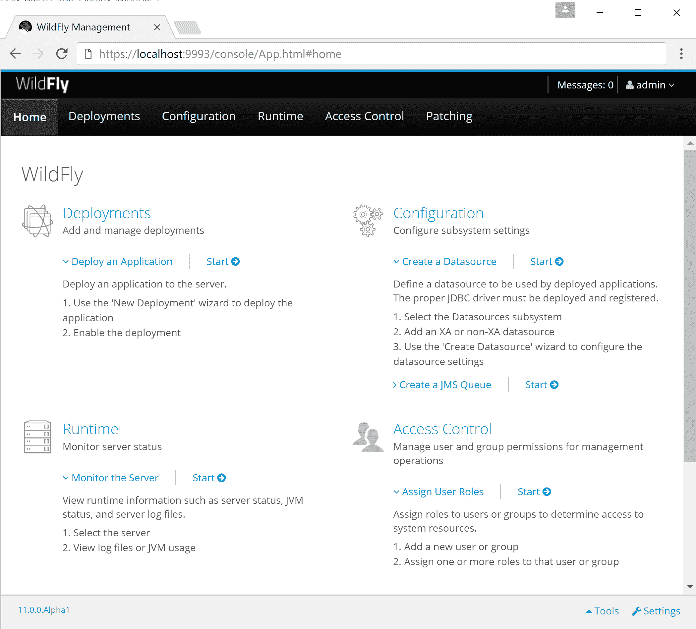

# 将证书部署到 WildFly - Octopus 部署

> 原文：<https://octopus.com/blog/wildfly-https>

Octopus Deploy 最近增加的一个功能是能够在您的基础设施中管理和部署证书。在这篇博文中，我将向您展示如何将证书从 Octopus 导出到 Java 密钥库中，然后使用该密钥库来保护运行在 Windows 上的 WildFly 独立实例或域实例。

## 先决条件

要运行这篇博文中的命令和脚本，您需要安装一些工具。

第一个是 OpenSSL 客户机。我使用了来自 [Shining Light Productions](https://slproweb.com/products/Win32OpenSSL.html) 的 Windows OpenSSL 二进制文件。

第二个是 Groovy SDK。你可以从 [Groovy 下载页面](http://groovy-lang.org/download.html)下载安装程序。

这些步骤用 [WildFly 11.0.0.Alpha1](http://wildfly.org/downloads/) 进行了测试。

最后，你还需要安装 Java 8 JDK。

## 创建证书存储

首先，我们需要将证书和私钥对上传到 Octopus Deploy 中。最简单的方法是创建一个自签名证书和私钥，然后将它们合并到一个 PKCS12 密钥库中。

要创建私钥和证书，请运行以下命令:

```
openssl req -x509 -newkey rsa:2048 -keyout private.pem -out certificate.pem -days 356 
```

系统会提示您提供密码并填写一些个人信息，之后会创建两个文件:`private.pem`和`certificate.pem`。这些文件是私钥和证书。

然后，我们需要将这两个文件组合成一个 PKCS12 密钥库，我们可以使用以下命令来完成:

```
openssl pkcs12 -export -in certificate.pem -inkey private.pem -out combined.pfx -name octopus 
```

`combined.pfx`文件现在包含证书和私钥，可以上传到 Octopus Deploy。

[](#)

## 导出证书存储

既然证书是由 Octopus 管理的，我们需要创建一个带有自定义脚本步骤的项目，以便将证书放到我们的 WildFly 服务器上。

首先，我们需要通过变量引用证书。在 Octopus 项目的`Variables`部分，创建一个名为`Certificate`的新变量，该变量引用刚刚上传的证书。

[](#)

【T2 

创建这个变量使我们能够访问证书中保存的信息的[种不同表示。](https://octopus.com/docs/projects/variables/certificate-variables#expanded-properties)

下面的脚本将证书和私钥作为 PEM 文件保存在目标服务器上，将它们合并到组合的 PKCS12 密钥库，然后将 PKCS12 密钥库导入到 Java 密钥库中。

作为我们 [Java RFC](https://octopus.com/blog/java-rfc) 的一部分，将这个证书直接公开为 Java 密钥库是我们打算包含在 Octopus 中的一个特性。但是今天，我们必须使用一个手动脚本来提取证书细节并将其导入到 Java 密钥库中。

这个脚本的最终结果是一个名为`c:\keystore.jks`的文件，它是我们可以从 WildFly 引用的 Java 密钥库，以启用 HTTPS 支持。

```
if ([String]::IsNullOrWhiteSpace($OctopusParameters["Certificate.CertificatePem"])) {
    Write-Error "Certificate is empty"
}

if ([String]::IsNullOrWhiteSpace($OctopusParameters["Certificate.PrivateKeyPem"])) {
    Write-Error "Private key is empty"
}

$OctopusParameters["Certificate.CertificatePem"] | Out-File -Encoding ASCII "C:\certificate.pem"
$OctopusParameters["Certificate.PrivateKeyPem"] |  Out-File -Encoding ASCII "C:\private.pem"
# Fix the error
# WARNING: can't open config file: /usr/local/ssl/openssl.cnf
$env:OPENSSL_CONF="C:\OpenSSL-Win64\bin\openssl.cfg"
C:\OpenSSL-Win64\bin\openssl.exe pkcs12 -export -inkey C:\private.pem -in C:\certificate.pem -name octopus -out C:\keystore.pfx -password pass:Password01
if (Test-Path C:\keystore.jks) {
  rm C:\keystore.jks
}
C:\Java\x86\jdk1.8.0_131\bin\keytool -importkeystore -srckeystore C:\keystore.pfx -srcstoretype pkcs12 -destkeystore C:\keystore.jks -storepass Password01 -srcstorepass Password01 -noprompt 
```

## 在 WildFly 中配置 HTTPS 支持

在我们开始配置 WildFly 以利用 Java 密钥库之前，有必要回顾一下我们在 WildFly 中配置 HTTPS 支持的确切含义。

WildFly 有两个 web 界面:客户端用来查看已部署的 Java 应用程序的界面，以及管理界面。两者都可以用 HTTPS 保护，尽管两者的过程略有不同。

此外，WildFly 可以以独立模式部署，也可以作为域部署。同样，为独立服务器和域服务器配置 HTTPS 支持也有细微的区别。

虽然 [WildFly CLI 工具](https://docs.jboss.org/author/display/WFLY10/CLI+Recipes)功能强大，并公开了配置 HTTPS 支持所需的所有功能，但它的运行级别较低，不包括像`configureHTTPS()`这样的功能。CLI 工具的一个缺点是它不是等幂的，这意味着使用 CLI 工具配置 WildFly 实例通常需要不同的步骤序列，这取决于服务器的当前状态。

当您从像 Octopus 这样的平台进行部署时，这并不理想。您想要的是有一种方法来描述您希望达到的理想状态(比如“配置 HTTPS”)，而不必知道服务器的当前状态。

为了方便起见，我们创建了一个 [Groovy 脚本](https://github.com/OctopusDeploy/JBossDeployment/blob/master/deploy-certificate.groovy)，它隐藏了需要通过 CLI 工具发出的低级命令，以便在 WildFly 中配置(或重新配置)HTTPS 支持。

## 独立模式下的 HTTPS 支持

要配置具有 HTTPS 支持的独立 WildFly 实例，请运行以下命令:

```
groovy deploy-certificate.groovy --controller localhost --port 9990 --user admin --password password --keystore-file C:\keystore.jks --keystore-password Password01 
```

用户名和密码需要与您已经用 adduser 脚本配置的相匹配。您可以通过打开 http://localhost:9990 并在提示登录时输入这些凭据来验证这些凭据是否有效。

在后台，脚本首先创建一个名为`octopus-ssl-realm`的安全领域，它引用密钥库:

```
<management>
   <security-realms>
      <security-realm name="octopus-ssl-realm">
         <server-identities>
            <ssl>
               <keystore path="C:\keystore.jks" keystore-password="Password01" alias="octopus" />
            </ssl>
         </server-identities>
      </security-realm>
      ...
   </security-realms>
</management> 
```

然后，它将配置一个引用安全领域的 https 侦听器:

```
<subsystem >
   <server name="default-server">
      <http-listener name="default" socket-binding="http" redirect-socket="https" enable-http2="true" />
      <https-listener name="https" socket-binding="https" security-realm="octopus-ssl-realm" enable-http2="true" />
      <host name="default-host" alias="localhost">
         <location name="/" handler="welcome-content" />
         <filter-ref name="server-header" />
         <filter-ref name="x-powered-by-header" />
         <http-invoker http-authentication-factory="application-http-authentication" />
      </host>
   </server>
   ...
</subsystem> 
```

最后，重新启动服务器，以便新设置生效。当你打开 https://localhost:8443/的时候，你会看到 WildFly 现在被你的自签名证书保护了。

[](#)

## 保护独立管理界面

保护管理接口可以简单地通过添加`--management-interface`参数来完成。

```
groovy deploy-certificate.groovy --controller localhost --port 9990 --user admin --password password --keystore-file C:\keystore.jks --keystore-password Password01 --management-interface 
```

虽然这只是对前一个命令的一个参数更改，但是实际完成的工作有点不同。

首先，从`ManagementRealm`中引用密钥库:

```
<security-realm name="ManagementRealm">
   <server-identities>
      <ssl>
         <keystore path="C:\keystore.jks" keystore-password="Password01" alias="octopus" />
      </ssl>
   </server-identities>
   ...
</security-realm> 
```

然后，管理界面被更新以包括 https 套接字绑定:

```
<management-interfaces>
   <http-interface security-realm="ManagementRealm">
      <http-upgrade enabled="true" />
      <socket-binding http="management-http" https="management-https" />
   </http-interface>
</management-interfaces> 
```

并再次重启 WildFly 实例以使更改生效。

现在，您可以打开 https://localhost:9993，通过 https 与管理控制台进行交互。

[](#)

## 域模式下的 HTTPS 支持

如果您作为域的一部分运行 WildFly，那么使用 HTTPS 保护 web 界面的命令实际上与您在独立模式下运行时是一样的。

但是，关于配置 WildFly 域的成员，有一些重要的事情需要记住。

首先，您运行脚本的控制器是域控制器。在后台，域控制器正在更新两个文件:

*   位于从服务器文件系统上的`host.xml`文件(或者当 WildFly 从服务器启动时传递到`--host-config`选项中的任何文件)。
*   位于域服务器文件系统上的`domain.xml`文件(或者当 WildFly 域控制器启动时传递给`--domain-config`选项的任何文件)。

第二件事是密钥库路径是相对于从属服务器的。因此，在运行这个命令之前，将`keystore.jks`文件复制到从属服务器是很重要的。

```
groovy deploy-certificate.groovy --controller domaincontroller --port 9990 --user admin --password password --keystore-file C:\keystore.jks --keystore-password Password01 
```

与独立服务器一样，在域中运行该命令将配置一个安全领域，但是这次是在当前域中所有从属服务器的`host.xml`文件中。

如果您只想更新特定的主机，请将它们传递给`--hosts`选项。例如，此命令将更新主机 slave1 和 slave2 的安全领域。

```
groovy deploy-certificate.groovy --controller domaincontroller --port 9990 --user admin --password password --keystore-file C:\keystore.jks --keystore-password Password01 --hosts slave1,slave2 
```

然后，它在域管理的每个配置文件中配置 https 侦听器。WildFly 自带 4 种配置文件:默认、高可用性、完全和完全高可用性。如果你只想更新特定的配置文件，将它们传递到`--profiles`选项中。例如，该命令将更新默认配置文件和 ha 配置文件中的 https-listener。

```
groovy deploy-certificate.groovy --controller domaincontroller --port 9990 --user admin --password password --keystore-file C:\keystore.jks --keystore-password Password01 --profiles ha,default 
```

## 保护域管理界面

保护域管理接口的命令几乎与保护独立管理接口的命令相同。惟一的变化是添加了`--management-port`参数，该参数定义了管理控制台将暴露的 https 端口。

```
groovy deploy-certificate.groovy --controller domaincontroller --port 9990 --user admin --password password --keystore-file C:\keystore.jks --keystore-password Password01 --management-interface --management-port 9993 
```

这将在套接字接口上设置`secure-port`属性。

```
<management>
   <management-interfaces>
      <native-interface security-realm="ManagementRealm">
         <socket interface="management" port="${jboss.management.native.port:19999}" />
      </native-interface>
      <http-interface security-realm="ManagementRealm">
         <http-upgrade enabled="true" />
         <socket interface="management" port="${jboss.management.http.port:9990}" secure-port="9993" />
      </http-interface>
   </management-interfaces>
   ...
</management> 
```

## 使用 HTTPS 管理界面

一旦使用 HTTPS 保护了管理接口，您就需要在运行脚本时指定`remote+https`协议，这是通过`--protocol`参数完成的。例如，此命令在具有 HTTPS 安全管理界面的域控制器上配置 ha 和默认配置文件。

```
groovy deploy-certificate.groovy --controller domaincontroller --port 9993 --protocol remote+https --user admin --password password --keystore-file C:\keystore.jks --keystore-password Password01 --profiles ha,default 
```

## 已知问题

似乎偶尔域控制器主机不会正常重新启动。更多详情见[https://issues.jboss.org/browse/WFLY-8975](https://issues.jboss.org/browse/WFLY-8975)。

您可以使用`--no-restart`选项阻止重启。

```
groovy deploy-certificate.groovy --controller domaincontroller --port 9990 --user admin --password password --keystore-file C:\keystore.jks --keystore-password Password01 --management-interface --management-port 9993 --no-restart 
```

## 后续步骤

这些 Groovy 脚本正在被开发，作为最终将被移植到 Octopus Deploy 中直接提供的步骤中的概念验证。

如果你对剧本有任何问题，请留下评论。如果有一些 Java 特性你希望 Octopus 在未来部署支持，请加入 [Java RFC 帖子](https://octopus.com/blog/java-rfc)的讨论。