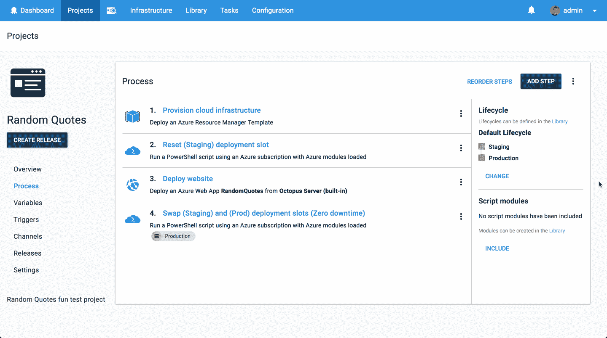
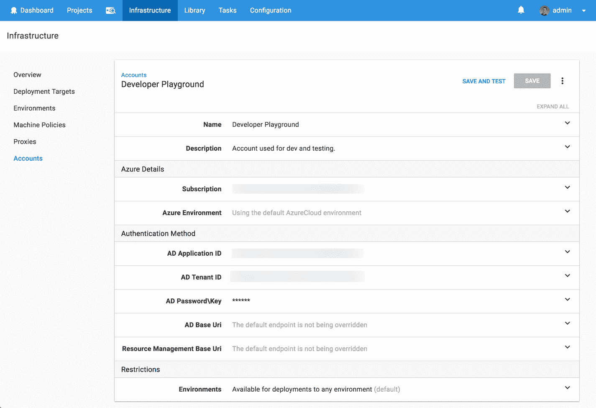
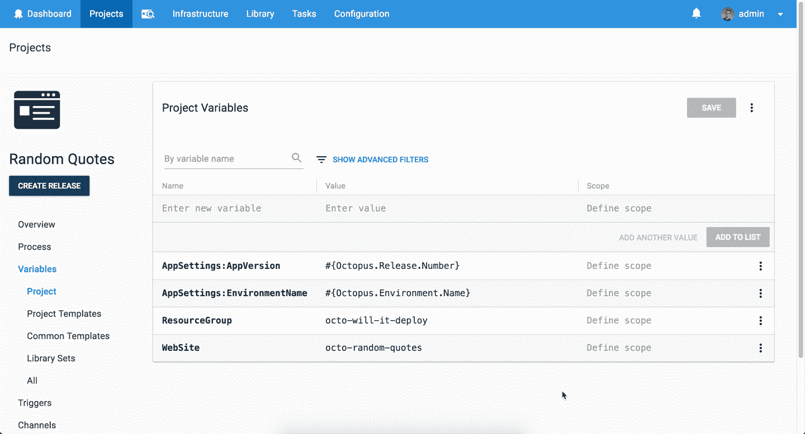

# 部署 ASP.NET 核心应用程序-它会部署吗？第 1 集-章鱼部署

> 原文：<https://octopus.com/blog/will-it-deploy-episode-01>

今天，我们将发布**它会部署吗？**这是我们全新的视频系列，我们尝试使用 Octopus Deploy 自动部署不同的技术。

我们以一个有趣的视频开始这个系列，我们试图将 ASP.NET 核心网络应用部署到微软的 Azure 平台上。光是这一点就很简单，所以我们决定通过自动调配我们的云基础架构并确保零停机生产部署来让它变得更有趣一些。

[https://www.youtube.com/embed/tQb8PJ0jzvk](https://www.youtube.com/embed/tQb8PJ0jzvk)

VIDEO

## 问题

### 技术堆栈

我们的应用程序是一个报价生成器，名为[随机报价](https://github.com/OctopusSamples/RandomQuotes)。这相当简单，但它将让我们了解如何将 web 应用程序自动部署到 Microsoft Azure 平台。

向我们的营销经理安德鲁致敬，他一直在学习编码并开发了这款应用的第一部分。干得好！

### 部署目标

## 解决办法

那么它会部署吗？是的，会的！我们的部署流程如下所示。

第一步是添加一个 Octopus Azure 帐户，该帐户拥有使我能够安全地连接到 Azure 平台所需的所有详细信息。它用于在部署或执行脚本时向 Azure 进行身份验证。

然后，我们添加以下步骤来成功部署我们的应用，包括云基础架构配置和零停机生产部署。

*   Octopus **部署 Azure 资源组**步骤，通过 ARM 模板供应我们的云基础设施。
*   Octopus **运行 Azure Powershell 脚本**步骤，以确保我们始终有一个新的应用服务部署位置。我们调用 Azure Powershell cmdlets 来删除和创建应用服务部署槽。
*   Octopus **部署 Azure Web App** 步骤将我们的 Web 应用程序部署到我们的 App Service staging 部署槽。
*   Octopus **运行 Azure Powershell 脚本**步骤来交换我们的应用服务阶段和生产(现场)部署槽。这仅在生产部署期间进行，以便我们实现零停机时间！

这个项目使用以下变量来存储我们的资源组名称、网站名称和应用程序设置。简单又好看！

本集的 [GitHub repo](https://github.com/OctopusSamples/WillItDeploy-Episode001) 包含了本视频中使用的所有资源和链接。

### 总结

我们希望您喜欢这个新系列，并且我们希望它可以帮助世界各地的人们学习如何自动部署他们的应用程序和服务。

不要忘记订阅我们的 [YouTube](https://youtube.com/octopusdeploy) 频道，因为我们会定期添加新视频。如果你想让我们探索某个框架或技术，请在评论中告诉我们。

愉快的部署！😃

## 了解更多信息