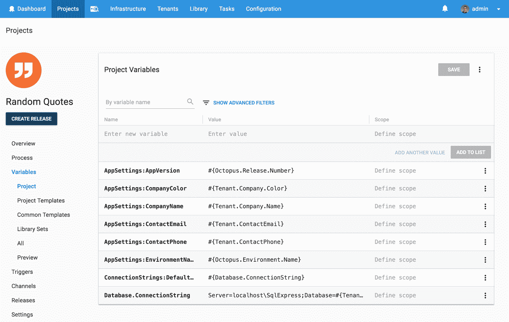

# 向多个客户部署多租户 Web 应用程序——它能部署吗？第 5 集-章鱼部署

> 原文：<https://octopus.com/blog/will-it-deploy-episode-05>

欢迎来到另一个**它会部署吗？**我们尝试使用 Octopus Deploy 自动部署不同技术的那一集。在这特别的两集节目中，我们试图为运行在亚马逊网络服务(AWS)虚拟机上的不同客户部署一个多租户 SaaS 网络应用。

[https://www.youtube.com/embed/KGqlKduFohI](https://www.youtube.com/embed/KGqlKduFohI)

VIDEO

## 问题

### 技术堆栈

我们的应用程序是一个报价生成器，名为[随机报价](https://github.com/OctopusSamples/WillItDeploy-Episode005)。该应用程序相对简单，但它包含许多通用特性，使我们能够说明多租户部署的复杂性。

特点:

*   为每位客户定制应用程序设置
*   应用程序启动时的动态特征/模块加载
*   为每位顾客定制颜色和款式

技术:

向我们的营销经理安德鲁致敬，他一直在学习编码并开发了这款应用的第一部分。干得好！

### 部署目标

## 解决办法

那么它会部署吗？是的，会的！我们的部署流程如下所示。

然后，我们添加以下步骤来成功部署我们的应用程序。

*   Octopus **部署包**步骤将我们的数据库脚本复制到我们的数据库部署目标
*   Octopus 社区贡献了 step template-**[SQL-Execute Script File](https://library.octopusdeploy.com/step-template/actiontemplate-sql-execute-script-file)**来针对我们的 SQL Server 数据库执行我们的实体框架核心迁移脚本。
*   Octopus **部署到 IIS** 部署多租户 ASP.NET 核心 web 应用程序的步骤
*   Octopus **部署一个包**步骤，将管理模块复制到客户的网站，如果他们为此功能付费的话
*   Octopus **部署一个包**步骤，将共享模块复制到客户的网站，如果他们为该功能付费的话

这个项目使用以下变量，变量模板和公共变量模板来存储我们的应用程序设置，数据库连接细节和 web 应用程序配置。

本集的 [GitHub repo](https://github.com/OctopusSamples/WillItDeploy-Episode005) 包含了本视频使用的所有资源和链接。

### 总结

我们希望你喜欢这一集，因为我们有更多的作品！如果你想让我们探索某个框架或技术，请在评论中告诉我们。

不要忘记订阅我们的 YouTube 频道，因为我们会定期添加新视频。愉快的部署！😃