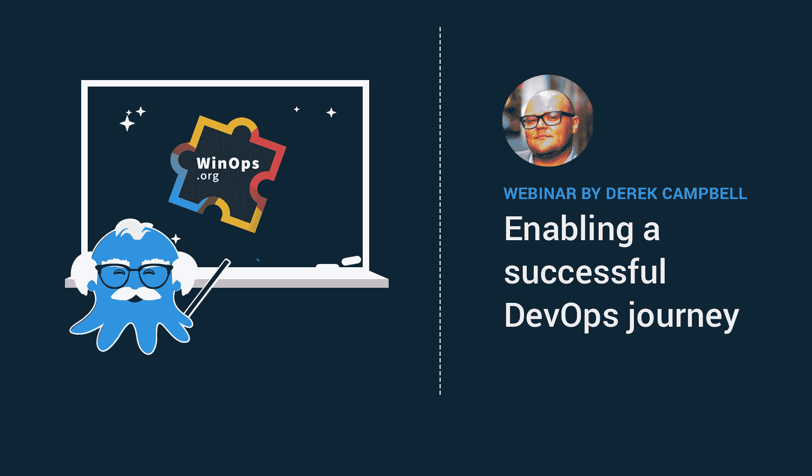

# 章鱼亮相 WinOps 2018 伦敦-章鱼部署

> 原文：<https://octopus.com/blog/winops-2018>

技术是任何好的商业策略的关键。您的技术、应用和产品的自动化是关键，没有它，您的业务很快就会变得无关紧要。对你和你的企业来说，成功是什么样的？更频繁地释放？发布更靠谱？消除停机时间？减轻开发团队的压力？

为什么不是全部？

在我的会议中，我将讨论一些现实世界中的 DevOps 实现策略。我将根据自己的经验，展示一些真实的案例研究，包括英国一些最大的公司，以及他们是如何实现 CI/CD 渠道自动化的。

在 Octopus Deploy，我们热衷于自动化所有部署，无论是代码、数据库还是基础设施。这就是为什么我很兴奋地宣布，我， [Derek Campbell](https://twitter.com/octoderek) 将在本月的 [WinOp 伦敦活动](https://www.winops.org/london/)上继续我们关于“Octopus Deploy 如何实现成功的 DevOps 之旅”的讨论。我将在 11 月 16 日发表演讲，我将展示一些我们客户成功案例的真实例子。

现在注册还来得及！您可以使用代码 ***Octopus10*** 注册，享受九折优惠。

如果你已经来了，那么一定要向我和我们的英国客户经理卡尔·麦克唐纳问好，并抢一些章鱼贴纸！