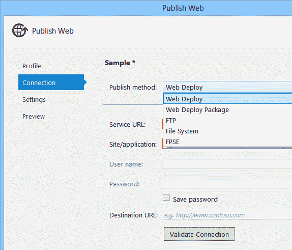
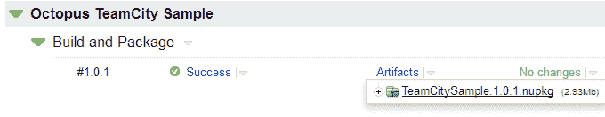

# 向导、对话框和上下文菜单，还是构建服务器和脚本？-章鱼部署

> 原文：<https://octopus.com/blog/wizards-vs-build-servers>

多年来，我一直热衷于使用持续集成工具。早期是有南特剧本的[CruiseControl.NET](http://www.cruisecontrolnet.org/)和[天龙](http://draconet.sourceforge.net/)，后来是[团队城](http://www.jetbrains.com/teamcity/)。即使是个人项目，我也喜欢使用 CI 服务器，原因有很多，包括:

*   它确保软件是在不是我的机器上构建的
*   它记得标记版本号，使用正确的发布/调试设置，以及其他我可能会忘记的步骤，使构建更加可靠
*   它确保了如果“构建人员”不在，构建仍然可以进行
*   它们为每个人提供了一个中央仪表盘，让他们知道构建的健康状况

中的每个新的持续集成服务器。NET 空间使得实现自动化构建更加容易。但是在从事 Octopus Deploy 之前，我从未找到一个自动化部署的好解决方案(我认为我们[还有很长的路要走](http://octopusdeploy.com/about)，但是我希望我们正在朝着正确的方向前进)。

在 Visual Studio 中，已经在上下文菜单和对话框中投入了数以百计的工时，使得将代码放在开发人员的机器上并放到生产服务器上变得很容易。接受这个对话:

我理解为什么 Visual Studio 中需要这样的工具。而且这些选项可以通过命令行使用(如果你有足够多的山羊可以牺牲)，所以自动化它们是可能的。但是，正如依赖开发人员的机器进行构建是错误的一样，从开发人员的机器进行部署也是错误的。

*   如果通常负责“通过 front page Server Extensions from Visual Studio 右键单击并发布到产品”的人不在，会发生什么情况？
*   如果您忘记更改为发布模式或更新连接字符串会发生什么？你记得运行单元测试吗？
*   您如何轻松地回滚到以前的版本，或者找到最后一个好的部署版本？
*   您团队中的其他人如何知道哪个版本处于试运行阶段，或者您正在部署到测试环境中？

这就是为什么对于 Octopus，我们致力于使打包应用程序作为自动化构建和部署的一部分变得容易，最好是在构建服务器上，而不是从您的开发机器上。代替向导、对话框和上下文菜单，我们投资了[团队城市插件](http://octopusdeploy.com/documentation/integration/teamcity)和 [MSBuild 扩展](https://github.com/OctopusDeploy/OctoPack)。我们相信鼓励我们的客户遵循良好的实践，比如在构建服务器上自动构建，并让他们很容易做到这一点。

当然，好心没好报，是要付出代价的。你不能在没有至少一个 NuGet 服务器和某种自动化构建过程的情况下，就从 Visual Studio 中的代码到 Octopus 的生产部署。我觉得比较好，但是不像向导和上下文菜单，有个问题:**演示的不是很好**。仅仅是尝试该产品就可能需要大量的前期投资。

所以我对自己说:Octopus 需要一个向导来打包你在工作站上构建的代码，并部署它吗？我们应该把有限的时间投资在 Visual Studio 插件和发布向导上吗？或者，我们应该投资于更好地构建服务器集成吗？期望人们使用命令行和构建脚本来创建包是不是太过分了？

当您第一次尝试 Octopus 时，您必须完成的第一步是创建一个 NuGet 包。你是怎么做到的？很难吗？它是否几乎让你在第一次部署之前就放弃了这个产品？

我们可以做些什么来使自动化部署更容易开始？