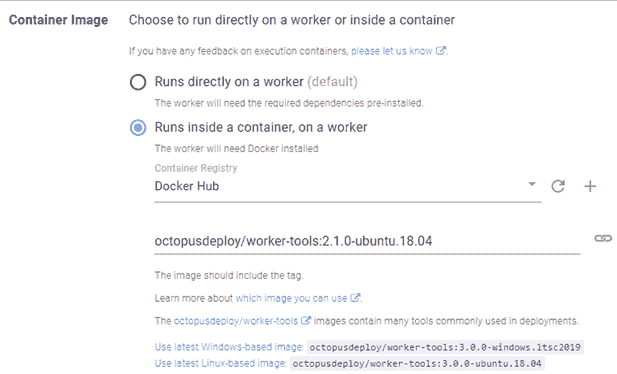
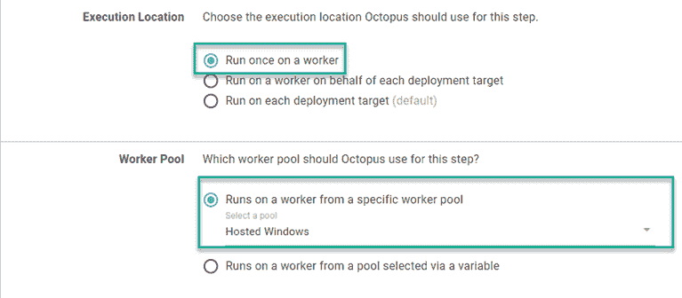
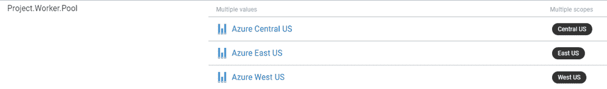
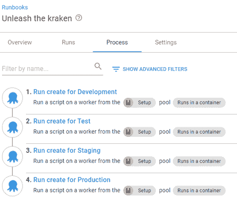
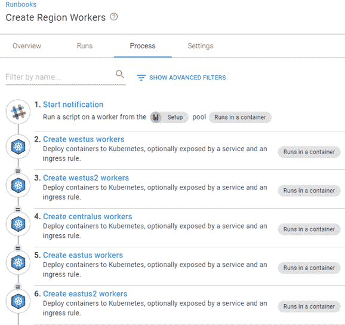
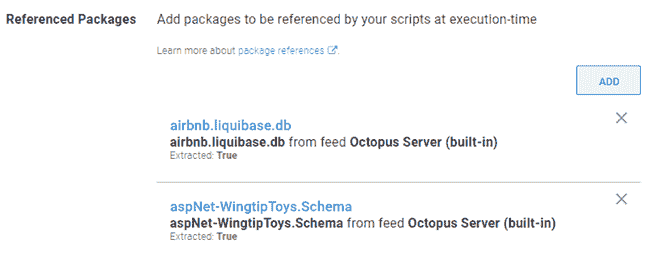
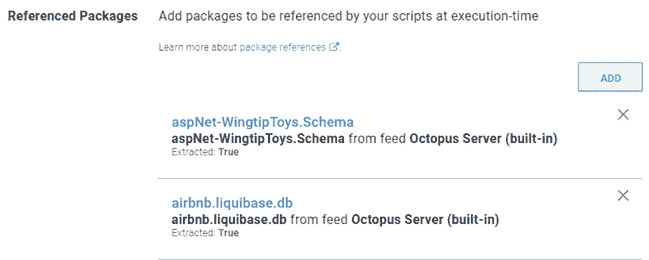

# 工作人员解释-章鱼部署

> 原文：<https://octopus.com/blog/workers-explained>

在 Octopus Deploy 的早期，随着产品的发展，对安装它的服务器提出了越来越高的要求。任何没有直接在[目标](https://octopus.com/docs/infrastructure/deployment-targets)上执行的步骤都在服务器本身上执行。

为了处理越来越多的直接在服务器上执行的任务，我们创建了 Workers 的概念。

在这篇文章中，我将回答一些关于工人以及他们如何工作的常见问题。

## 工人到底是什么？

本质上，工人是一根触手。它运行与部署目标相同的触手软件，但是它是在工作池中的服务器上注册的。工作池是工作机的集合。

### 如果工人是触手，算不算许可对象？

尽管运行着触手软件，但工人被视为 Octopus 服务器的延伸，因此不被算作目标。

在当前的许可模式下，您可以拥有多少台工作机是没有限制的。

## 什么是内置工人？

所有 Octopus 实例都定义了一个默认的工人池。任何选择**默认工人池**的步骤都在内置工人上执行，这个工人就是 Octopus 服务器。然而，如果一个工作机被添加到**默认工作机池**，这个内置工作机就不再被使用了。

## 工人可以用来做什么？

Workers 可以用于不需要在目标上执行的步骤。最常见的使用案例是:

*   数据库部署
*   API 或 Web 服务调用
*   运行脚本
*   Kubernetes 部署

### 数据库部署

部署数据库更新只需要一个到数据库服务器和正在使用的数据库的连接字符串。工作人员可以帮助执行数据库部署，而不必在数据库服务器上安装额外的软件。

### API 或 Web 服务调用

Workers 非常适合调用 API，或者不需要目标就能运行的 Web 服务。例子包括:

*   时差通知
*   Microsoft 团队消息
*   部署 SQL Server Reporting Services 报表

### 运行脚本

运行脚本是工作者的另一个用例。进程密集型操作可以被卸载到一个工人上运行，而不是减慢 Octopus 服务器。

### Kubernetes 部署

Kubernetes (K8s)目标是唯一需要工人的目标类型。

K8s 目标的工作人员要求安装`kubectl` CLI。因此，您可以在 K8s 目标屏幕上选择在运行状况检查操作期间使用的工作池。

Kubernetes 部署与 API 交互，向 K8s 集群提供指令，而不是直接向其部署文件。这对工人来说是一个完美的用例。

## 使用工人的优势

工人提供两大优势:

*   从 Octopus 服务器卸载进程
*   Ability to run customized software

### 从 Octopus 服务器卸载进程

长时间运行或密集的进程会影响 Octopus 服务器的性能。这些任务可以卸载到一个工作机，释放资源，让 Octopus 服务器以最佳状态运行。

### 定制软件

Octopus 附带的捆绑软件可能不包含流程所需的所有内容。有了工作人员，您可以安装定制软件包来帮助您的部署或 runbook 过程。

如果 Worker 安装了 Docker，它可以使用[执行容器](https://octopus.com/docs/projects/steps/execution-containers-for-workers)特性来定制容器，而不是直接在 Worker 上安装软件。

【T2 

## 如何指定使用工人的步骤？

当在 [Runbook](https://octopus.com/docs/runbooks) 或[项目部署过程](https://octopus.com/docs/projects/deployment-process)中定义一个步骤时，可以告诉 Octopus 这个步骤在一个 Worker 上运行并选择一个池。

[](#)

### 工人池变量

您可能已经注意到 **Worker Pool** 部分有第二个选择，**运行在通过变量**选择的池中的一个 Worker 上。我们创建了[工人池变量](https://octopus.com/docs/projects/variables/worker-pool-variables)，用于在不同的情况下需要不同的工人池，比如环境。

有些人进行了安全隔离，这样开发人员就不允许接触测试中的资源。使用 Worker Pool 变量，您可以将池的范围扩大到环境，甚至是表示特定 Azure 区域的租户标签。

[](#)

## 工人的执行与目标有何不同？

如果您试图对同一台目标机器执行两个部署，您可能会注意到部署似乎在任务之间来回切换，一次执行一个步骤。此行为旨在保护目标，防止多个部署试图同时更新同一资源，如 IIS 元数据库。另一方面，工作人员被配置为同时处理多项任务。

像`Acquire Packages`这样的活动会导致一个工作线程被锁定，而使用同一个工作线程的任何其他部署/runbook 都处于等待状态。

## 如何从人才库中挑选员工？

工人是以循环赛的方式从人才库中挑选出来的。需要注意的是，在部署或运行手册运行的*开始*选择工人。我将在这篇文章的后面解释工人选择的注意事项。

假设每个步骤由池中不同的工作人员执行是最安全的。

考虑以下场景，其中工作池`Setup`由以下部分组成:

运行手册**释放克拉肯**调用运行手册`Create AWS RDS`进行环境开发、测试、准备和生产。

[](#)

流程中的所有步骤按顺序执行，但配置为不等待运行手册完成就进入下一步(详情见[运行 Octopus 部署运行手册步骤](https://library.octopus.com/step-templates/0444b0b3-088e-4689-b755-112d1360ffe3/actiontemplate-run-octopus-deploy-runbook))。工人选择如下:

```
Unleash the kraken
|
+-- worker1
|    |
     Create AWS RDS Development
     |
     +-- worker1
     |
     Create AWS RDS Test
     |
     +-- worker2
     |
     Create AWS RDS Staging
     |
     +-- worker3
     |
     Create AWS RDS Production
     |
     +-- worker1 
```

### 工人选择警告

有些情况会影响 Octopus 选择员工的方式:

*   引用包的步骤
*   包装参考订购
*   人工干预

#### 引用包的步骤

任何使用相同包的步骤都在相同的工作机器上执行。例如，run book**Create Region Workers**将相同的映像部署到不同 Azure 区域中的 Kubernetes 集群。因为步骤 2 到 6 使用相同的包(映像)，所以它们都使用相同的 Worker。

[](#)

#### 参考包装订购

薪资包参考排序也会影响员工选择。例如，如果有两个步骤以相同的顺序引用相同的包，那么 Octopus 会在同一个 Worker 上运行这两个步骤。

[](#)

但是，如果包的顺序不同，八达通为每个步骤选择不同的工人。

[](#)

#### 人工干预

当遇到[手动干预](https://octopus.com/docs/projects/built-in-step-templates/manual-intervention-and-approvals)步骤时，它将从任务队列中删除。在干预被执行之后，任务被添加回队列，这迫使工人选择再次发生。

## 我在用章鱼云，动态工作者是怎么工作的？

Octopus Deploy 维护了一组工作器(VM ),您可以按需将它们用作动态工作器。这些员工可在以下人才库中找到:

*   默认工作池(Windows Server 2016)
*   托管 Windows (Windows Server 2019 `*`)
*   托管的 Ubuntu (Ubuntu 18.04 `*`)

`*`池可以使用执行容器特性。

每个云实例可以为每个池租赁一个工作线程，专门用于该云实例。租约到期后，工人被销毁(时间到期见[这篇关于动态工人的文章](https://help.octopus.com/t/how-do-dynamic-workers-work-in-octopus-cloud/25228/2)。)销毁后，将供应一个新的工作线程，并将其添加到可供云实例租赁的可用工作线程池中。

## 结论

我希望这篇文章能澄清什么是工人，他们是如何被使用和选择的。写这篇文章让我学到了很多。

如果您需要帮助或想了解更多关于使用员工的信息，您可以通过[customersuccess@octopus.com](mailto:customersuccess@octopus.com)联系我们的客户成功团队。

愉快的部署！