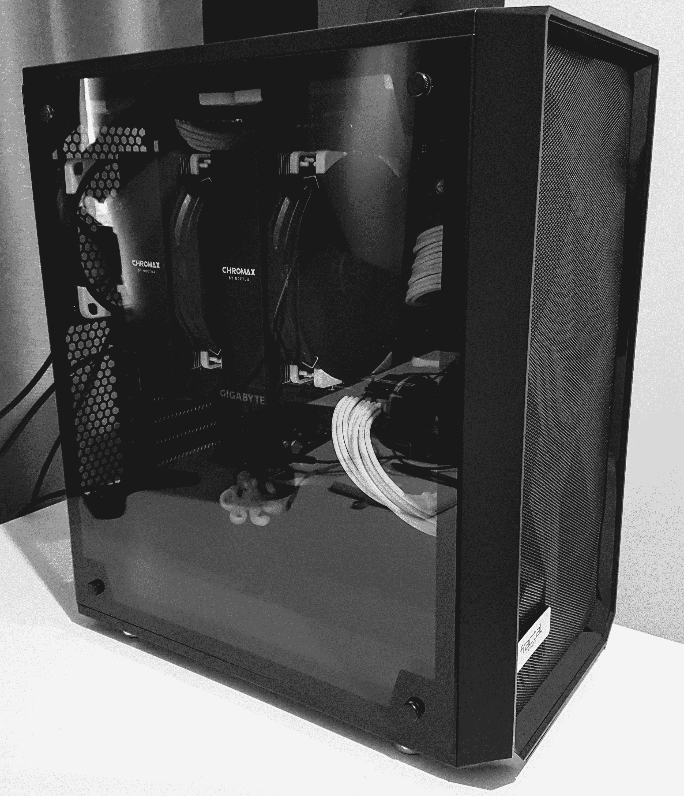

# 在八达通工作-硅和钢的故事-八达通部署

> 原文：<https://octopus.com/blog/working-at-octopus-silicon-and-steel>

我在八达通的五周年纪念日很快就要到了。为了庆祝，我决定利用八达通政策，它提供了我每天最常用的工具:电脑。在 Octopus 工作的最大好处之一是计算机项目，这项政策让我每隔几年就更新一次硬件，并保留(或捐赠)我的旧硬件。

在成长过程中，我接触过一台 386 电脑，配有涡轮按钮和 2400bps 调制解调器。我认为这是世界上最好的东西，但当我的朋友开始得到 486 和奔腾时，我很快就变得嫉妒了。我的嫉妒在惊奇地看着《星际争霸》时达到了顶峰，难过的是它永远不会在我爸爸的笨重的 386 上运行。

当我开始在 Octopus 工作时，我第一次尝到了顶级电脑的滋味。我选择了微星 WS60 笔记本电脑，这是一个强大的功能和便携性的平衡。我记得我第一天到办公室。保罗·斯托弗(首席执行官)最近骑着他的摩托车从当地的一家电脑商店回来，我的笔记本电脑绑在他的背上。太壮观了。

随着 Octopus 的成长，我越来越多地参与性能调查，Octopus 变得更加以远程为中心。我的下一台笔记本电脑牺牲了便携性，换来了强大的功能和存储空间。Metabox 提供你能想象到的任何规格的笔记本电脑，所以我选择了一台更大的 Metabox Prime 笔记本电脑，它有很多内存和 2TB 的存储空间。我欣赏额外的力量，我的按摩师也欣赏额外的尺寸。

为了五周年纪念电脑，我着手制作终极代码编译工作站。它将被称为 Octobox-V，它的功能足够强大，可以在 10 分钟内加载 Visual Studio(zing ),但又足够小巧时尚，可以放在我的桌子上。我想摆脱笔记本电脑常见的风扇噪音和散热问题。我会造一个精简的，吝啬的，章鱼桌面机。

这个配置是我想出来的:

Ryzen 7 2700X, 32GB DDR4 3200, RTX 2070, 1TB PCIe, 2TB SATA

那么它的表现如何呢？与 Octobox-V 正在取代的极其强大的笔记本电脑相比，编译时间减少了 65%。它是完全无声的。对于性能调查中常见的进程转储和数据库备份有足够的空间(所以请将它们发送到 support@octopus.com)。对于不在家的工作，我有一台超极本，我用它通过 VPN 到 Octobox-V 来远程桌面，因此性能和便携性之间没有任何折衷。最棒的是，它玩了一个星际争霸的卑鄙游戏。