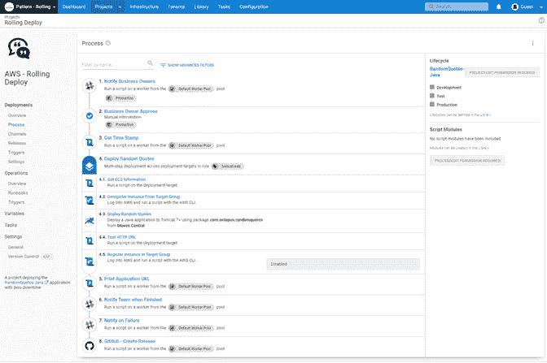

# 从零到章鱼英雄-发现 DevOps -章鱼部署

> 原文：<https://octopus.com/blog/zero-to-octopus-hero-part-2>

嘿，伙计们，欢迎来到我的零到英雄博客系列的第二部分。

我于 2021 年 10 月加入 Octopus Deploy，我正在学习该产品。在第一部分中，我介绍了 Octopus Deploy 的功能，并建立了基础设施。

在第 2 部分中，我将介绍 Octopus Deploy 如何帮助您的组织实现 DevOps。

## DevOps 简介

“DevOps 是人员、流程和产品的结合，能够为我们的最终用户持续提供价值。”多诺万·布朗。

我已经在 IT 行业工作了很多年，在部署服务器或帮助向客户发布新版本的软件时，我用自己的方式完成了许多清单。

虽然清单很有帮助，但过程中的人为因素可能会有缺陷。问题包括:

*   假设你完成了一项任务
*   跳过任务
*   使用过期版本的清单

这就是 DevOps 的帮助之处。如果你把你的清单构建成一个自动化序列，自动化工具不会做任何假设，也不会因为累了或者赶时间而跳过一个任务。

DevOps 引入了我们在 IT 环境中需要的一致性。在许多情况下，它完成任务的速度也比人快。

当我们谈论 DevOps 时，您经常会听到持续集成和持续部署(CI/CD)这两个术语。

持续集成(CI)是将代码签入版本控制系统的过程。一个流行的工具是 Git，代码库选择包括 GitHub、GitLab、Azure DevOps 和 BitBucket。

CI 将您的代码放入构建您的代码或编译您的应用程序的管道中。然后它完成自动化测试。然后将您的代码或应用程序打包到一个可部署的工件中，比如一个 Zip 文件、NuGet 包或 Docker 映像。然后可以使用连续部署(CD)管道来部署您的工件。

持续部署(CD)关注于您的位、代码或应用程序的部署、实际安装和分发。CD 帮助您在不同的环境中分发您的代码或应用程序，从开发、测试到生产。

## 部署了 Octopus 的 DevOps

Octopus Deploy 与 Azure DevOps、TeamCity、Bamboo、Jenkins 和 GitHub Actions 等[持续集成(CI)服务器(也称为构建服务器)](https://octopus.com/blog/tag/CI%20Series)协同工作。

在几周的时间里，我在 Azure DevOps 中使用 CI 管道构建了一个 ASP.NET 应用程序，然后将它传递给 Octopus 以部署到我的云平台上。

### 步骤模板

Octopus Deploy 自动化和加速部署的方式令人印象深刻。您使用[步骤模板](https://octopus.com/docs/projects/built-in-step-templates)配置您的 CD 管道。步骤模板的范围从能够运行脚本到将证书导入 Windows 服务器。

这些步骤模板通过提供代码来加速您的过程。您不必知道将证书导入服务器等任务的脚本语法。相反，您选择步骤模板，然后回答一些基本问题，剩下的就交给 Octopus Deploy 了。

【T2 

我不是一名开发人员，所以这使得开始使用 Octopus Deploy 和建立一个工作 CD 管道变得快速而容易。

### 运行手册

在我的部署管道中使用 Octopus Deploy 的[run book](https://octopus.com/docs/runbooks)已经改变了游戏规则。

我建立了一个流程，将我所有的基础设施组件、Azure 中的资源组、web 应用和 SQL 数据库部署为我的 CD 管道的一部分。

我还使用了一个 runbook 进程来拆除我所有的 Azure 资源，以避免在我不使用资源时产生不必要的成本。

## 部署策略

部署策略(或模式)对于任何软件部署或更新管理都很重要。部署策略有助于减少停机时间，并为推出新功能创建无缝流程。

我了解到，在开发和 DevOps 领域，部署策略有着令人兴奋的名字:

*   滚动部署
*   蓝色/绿色部署
*   金丝雀部署
*   多区域部署

了解每种策略之间的区别以及何时最好地使用它们是很有趣的。这些概念对我来说并不陌生，只是当我们从 DevOps 的角度处理软件部署或系统升级时的术语和好处。

我们有一篇[有用的博客文章](https://octopus.com/blog/common-deployment-patterns-and-how-to-set-them-up-in-octopus)介绍了这些部署模式以及每种模式如何与 Octopus Deploy 一起使用。

## 使用 Octopus 进行滚动部署

采用我之前构建的基本管道并使其适应滚动部署是一个简单的过程。在步骤模板中有一个配置滚动部署的选项，然后 Octopus Deploy 将进一步设置您想要的步骤作为子步骤，直到您的滚动部署的逻辑完成。

它使复杂的过程变得简单。

## 经验教训

这是对 Octopus 团队的证明，而不是我的技能，我可以如此轻松地使用 Octopus Deploy 进行部署。

我了解到你的逻辑不能有缺陷，你的部署才能成功。花时间规划您的部署过程。思考需要发生的步骤以及顺序。

在 Octopus 中配置步骤时，考虑以下问题，为自己的成功做好准备:

*   我需要什么变量？
*   我什么时候需要进行人工检查，什么可以完全自动化？

我担心我缺乏开发经验会成为学习 DevOps 的障碍，但事实并非如此。有新的术语，但我已经熟悉了这些概念。

我的建议是:不要害怕测试你的知识和学习新的东西，你可能会让自己大吃一惊。

## 后续步骤

接下来，我想了解 Octopus Deploy 的更多特性，并了解它如何与其他工具集成。

我很享受我的学习之旅，也很享受概念开始产生的方式。我对扩展我的知识和测试它感到兴奋。

一定要回来看看我进展如何。我们会在该系列的其他文章中添加链接。

愉快的部署！