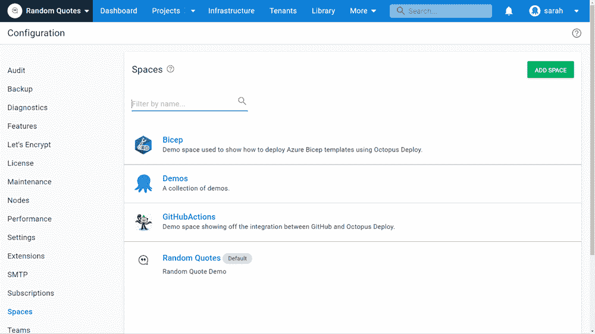

# 从零到章鱼英雄-章鱼功能和集成-章鱼部署

> 原文：<https://octopus.com/blog/zero-to-octopus-hero-part-3>

嘿，伙计们，很高兴回到我的零到英雄博客系列的第 3 部分。

我于 2021 年 10 月加入 Octopus Deploy，我正在学习，我想与你分享。在第一部分中，我介绍了 Octopus Deploy 的功能。在《T2》第二部中，我发现了章鱼在 DevOps 中扮演的角色。

在本文中，我将探讨 Octopus Deploy 如何与组织使用的其他工具集成。我还深入了解了 Octopus Deploy 的更多特性。

## 配置为代码

版本控制是 DevOps 方法的核心组成部分。版本控制你的 Octopus 配置现在可以用代码为的 [Config 来完成。](https://octopus.com/blog/config-as-code-eap)

使用 Config as Code，您可以查看部署过程的变更历史，包括谁在何时执行了变更，以及 Octopus 项目的版本控制(Git)文本表示。如果您也将应用程序存储在 GitHub 中，那么您就有了一个真实的来源，应用程序代码、构建脚本和部署配置都在一个地方。

为了探索这个特性，安装用于 Visual Studio 代码插件的 Octopus Deploy。该插件有助于语法高亮显示。Octopus 在 Git 存储库中创建的 OCL 文件。

观看由我们的产品总监 Michael Richardson 主持的深度网络研讨会，了解更多关于 Config as Code 的信息。

[https://www.youtube.com/embed/oZfxlbpSP14](https://www.youtube.com/embed/oZfxlbpSP14)

VIDEO

## 导出和导入项目

Octopus 中有一个方便的功能，可以将项目导出，然后导入到另一个空间，让您可以更好地控制如何组织 Octopus 实例。您可以将一个空间中的项目的设置和配置带到另一个空间。

我花时间建立了我的第一个空间和项目，把一切都做对了。然后，我使用导出/导入功能，将一些工作带到了另一个空间。

我可以导入:

这是 Octopus 中的一个有用特性，可以在实例之间移动项目，或者将项目拆分到多个空间以获得更好的可见性。

它*不能*进出口就不值钱；

## 认证系统集成

大多数组织都建立了现有的身份认证系统。活动目录是一个广泛使用的例子。Octopus Deploy 可以与多种身份验证系统集成，包括:

*   活动目录身份验证
*   Azure 活动目录身份验证
*   GoogleApps 认证
*   Okta 认证
*   开源代码库
*   LDAP 认证

查看[认证提供者兼容性文档](https://octopus.com/docs/security/authentication/auth-provider-compatibility)了解更多信息。

我们建议您将身份验证设置为向所有用户提供一致的体验。如果您要将 Octopus Deploy 引入到您的环境中，您希望避免为您的用户提供另一个用户名和密码组合来进行管理。

## 个性化您的空间

我做的一件有趣而有价值的事情，也是我推荐你做的，就是用描述和标识定制你的空间。

在**配置**下，然后是**空间**，然后在每个章鱼空间里，可以添加描述和 logo。添加这些内容有助于您快速识别共享空间。这也让和你一起工作的其他人很容易区分每个空间。

## 结论

我真的开始觉得使用 Octopus Deploy 很舒服了。总是有更多的东西需要学习，但是拼图正在拼起来。

如果你还想知道什么，请在下面留下评论。

愉快的部署！